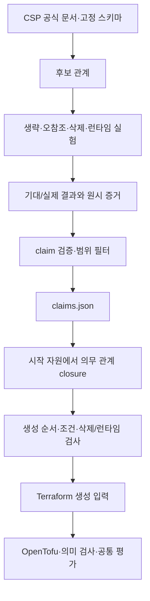

# 클라우드 리소스 의존성 분석 안내서

이 문서는 클라우드를 처음 접하는 사람도 EasyDep의 리소스 의존성 분석을 이해할 수 있도록
작성한 현재 기준 문서다. 무엇을 만들었는지만 나열하지 않고, 왜 조사했는지, 어떤 질문을
어떻게 검증했는지, 그 결과가 시스템의 어디에 쓰이는지와 무엇을 아직 주장할 수 없는지를
함께 설명한다.

## 1. 한 문장으로 설명하면

클라우드 리소스 의존성 분석은 **어떤 클라우드 자원 A를 만들고 운영하려면 다른 자원 B가
어떤 조건에서 필요하며, 연결하거나 제거했을 때 어떤 일이 생기는지를 근거와 함께 조사하는
일**이다.

예를 들어 “Docker 애플리케이션을 VM에 배포한다”는 말만으로는 실제 배포가 되지 않는다.
VM은 네트워크 인터페이스에 연결되어야 하고, 인터페이스는 서브넷과 네트워크에 속해야 한다.
외부 접근이 필요하면 방화벽 규칙이나 공인 IP 또는 로드밸런서가 추가될 수 있다. 데이터를
보존하려면 별도 디스크도 고려해야 한다. 이 연결을 LLM의 기억에만 맡기지 않고, CSP 문서와
실제 API 실행 결과로 확인해 기록한 것이 DepKB다.


## 2. 왜 필요한가

### 2.1 사용자는 처음부터 리소스 이름을 알기 어렵다

사용자에게 처음부터 “로드밸런서를 쓸까요?”, “VM은 몇 대인가요?”, “어떤 디스크를
붙일까요?”라고 묻는 것은 요구사항 분석의 책임을 사용자에게 넘기는 셈이다. 사용자는 보통
다음과 같은 목적을 말할 수 있을 뿐이다.

- 인터넷에서 접근할 수 있어야 한다.
- 장애가 나도 서비스를 계속하고 싶다.
- 재배포 후에도 데이터를 보존해야 한다.
- 특정 CSP·리전과 월 예산을 지켜야 한다.

EasyDep은 이런 자연어를 요구사항 에이전트가 구조화하고, 설계 단계가 워크로드와 외부 진입,
영속성 같은 구조를 결정한 다음, 구현 경계에서 DepKB가 빠진 클라우드 자원을 보충하도록
구성한다. 즉 DepKB는 사용자의 요구를 대신 정하는 도구가 아니라, **이미 선택된 배포 구조를
클라우드에서 성립시키기 위한 의존 자원을 계산하는 도구**다.

### 2.2 같은 개념도 CSP마다 표현이 다르다

AWS, Azure, GCP는 비슷한 기능을 서로 다른 API와 자원 이름으로 제공한다. 예를 들어 VM의
권한 부여는 AWS의 IAM role 및 instance profile, Azure의 managed identity, GCP의 service
account로 실현된다. DepKB는 이를 `workloadIdentity`라는 연구용 정규화 어휘로 표현하면서
원래 CSP 표현도 근거에 남긴다.

이 정규화는 Cloud-Barista 용어를 표준처럼 복사한 것이 아니다. TOSCA의 Compute, Network,
Port, BlockStorage 개념과 각 CSP의 공식 자원 모델을 대조해 본 연구가 정한 **조작적
어휘**다. 따라서 논문에서도 국제 표준이라고 주장하지 않고, 세 CSP를 같은 기준으로
비교하기 위한 연구상의 대응표라고 설명한다.

### 2.3 LLM의 그럴듯한 추측을 통제해야 한다

LLM은 “VM에는 공인 IP가 필수다”처럼 문맥에 따라 틀린 일반화를 만들 수 있다. 실제로는
CSP의 기본값, 구성 방식, 외부 접근 방법에 따라 달라진다. DepKB는 답과 함께 다음을
보존한다.

- 어느 CSP에서 확인했는가
- 어떤 구성과 조건에서 확인했는가
- 스키마, API 검증, 실제 생성, 런타임 측정 중 무엇을 했는가
- 기대 결과와 실제 결과는 무엇이었는가
- 근거 파일과 위치는 어디인가
- 이번 연구 리비전에서 재현됐는가

따라서 에이전트는 기억으로 보편 법칙을 만드는 대신, 확인된 범위만 사용하고 조건이나
미측정 사항은 사용자 질문 또는 보류 상태로 남길 수 있다.

## 3. 연구 범위

이 연구의 대상은 다음으로 제한한다.

- AWS, Azure, GCP
- Linux VM 위에서 실행되는 하나 이상의 Docker 컨테이너
- VM 배포의 핵심 네트워크·컴퓨트·접근·영속성 관계

Kubernetes, VPN, 서버리스, 관리형 데이터베이스, 메시지 큐, 오브젝트 스토리지, CSP 간
네트워크는 제외한다. 학부 졸업과제에서 모든 클라우드 서비스를 얕게 다루기보다, 세 CSP의
Docker-on-VM 배포를 반복 측정할 수 있는 범위로 제한하기 위해서다.

현재 관계 주체는 `vm`, `nic`, `network`, `subnet`, `firewall`, `loadBalancer`이고, 관계
대상에는 `disk`, `publicIp`, `sshKey`, `workloadIdentity`, `defaultRoute` 등이 추가된다.
다만 machine image, 일반 route table, LB backend·listener·health check, DNS와 TLS 인증서는
아직 DepKB 관계 분석 범위에 들어오지 않았다. 따라서 현재 결과는 **모든 VM 배포 자원의
완전한 모델**이 아니라 **VM 배포 핵심 관계 분석**이다.

## 4. 무엇을 의존성으로 보았는가

“필수”라는 한 단어로 생성, 삭제, 실행을 모두 표현하면 의미가 뒤섞인다. 이 연구는 질문을
세 관계군으로 분리했다.

### 4.1 프로비저닝 관계: 만들 수 있는가

프로비저닝은 클라우드 API를 통해 자원을 생성하는 과정이다.

| 판정 | 쉬운 뜻 | 판정 기준 |
|---|---|---|
| `mandatoryForProvisioning` | B가 없으면 A 생성이 거부됨 | 정한 구성에서 B를 빼고 생성 요청이 실패함 |
| `conditionalForProvisioning` | 조건에 따라 B가 필요함 | 모드·배치·선택 조건에 따라 결과가 달라짐 |
| `notMandatoryForProvisioning` | 이 구성에서는 B 없이 A 생성 가능 | 생략한 생성 요청이 성공함 |

`notMandatoryForProvisioning`은 B가 쓸모없다는 뜻이 아니다. 예를 들어 자원 생성은 되지만
외부 통신이 안 될 수 있다. 그래서 런타임 관계를 별도로 측정한다.

CSP가 생략값을 처리하는 방법도 구분한다.

- `providerDefaulted`: CSP가 이미 존재하는 기본 대상을 선택한다.
- `providerCreated`: CSP가 필요한 하위 자원을 새로 만든다.
- `explicitlyAttachable`: 없어도 생성되지만 사용자가 명시적으로 붙일 수 있다.

### 4.2 생명주기 관계: 붙인 뒤 삭제할 수 있는가

생명주기 분석은 A와 B가 연결된 뒤 한쪽을 지우려고 할 때의 결과를 본다. 현재 데이터에는
삭제가 연결 때문에 거부되는 `deleteBlockedWhileAttached` 관측 11개가 사용된다. 스키마는
분리 후 삭제, 소유자와 함께 삭제, 독립 잔존 같은 다른 결과도 구별할 수 있도록 설계했지만,
현재 활성 claim 수치는 실제로 들어 있는 판정만 보고한다.

이 관계는 IaC의 삭제 순서와 정리 절차에 필요하다. 생성 순서만 맞아도 삭제 순서를 틀리면
리소스가 남아 비용이 발생하거나 배포 삭제가 실패할 수 있기 때문이다.

### 4.3 런타임 관계: 생성 후 필요한 기능이 동작하는가

런타임 분석은 자원이 존재하는지만 보지 않고 미리 정한 신호를 측정한다. 예시는 다음과 같다.

- 외부에서 VM의 TCP 포트에 도달할 수 있는가
- VM에서 외부 HTTPS 요청을 보낼 수 있는가
- 로드밸런서를 통해 백엔드 응답을 받을 수 있는가
- 디스크 연결 뒤 읽기·쓰기 신호가 유지되는가

`runtimeRequiredForSignal`은 B를 제거했을 때 그 **특정 신호**가 실패하고 복구했을 때 다시
성공했다는 뜻이다. 애플리케이션 전체 기능, 성능 또는 가용성을 보증한다는 뜻은 아니다.
예를 들어 `defaultRoute`는 게이트웨이 자원 전체가 아니라 목적지가 `0.0.0.0/0`인 IPv4
기본 경로만 뜻한다.

## 5. 조건을 어떻게 다루었는가

클라우드 관계는 조건 없는 보편 법칙이 드물다. 조건을 산문 메모로만 남기지 않고 다음처럼
구조화했다.

| 조건 종류 | 예시 |
|---|---|
| `always` | 측정 구성에서 별도 분기가 없음 |
| `conditional` | CSP 모드나 설정값에 따라 결과가 달라짐 |
| `placement` | ALB는 서로 다른 가용영역의 서브넷이 2개 이상 필요 |
| `exclusiveChoice` | Azure LB frontend가 후보 중 정확히 하나를 선택 |
| `compatibility` | 디스크와 VM의 리전·존이 호환되어야 함 |

이 명칭은 외부 표준의 판정값인 것처럼 주장하지 않는다. 반복되는 CSP 조건을 기계가 읽을
수 있게 만든 내부 분류이며, 각 실제 조건의 근거는 CSP 스키마와 실험 결과에 둔다.

## 6. 무엇을 조사했는가

조사는 다음 질문에 답하기 위해 진행했다.

1. **자원 어휘:** 세 CSP에서 같은 역할을 하는 자원을 무엇이라 부를 것인가?
2. **생성 의무:** B를 생략하거나 잘못 참조하면 A 생성이 거부되는가?
3. **기본 동작:** 생략했을 때 CSP가 기존 기본값을 선택하는가, 새 자원을 만드는가?
4. **조건과 수량:** 리전·존·가용영역·배타 선택·최소 개수 조건이 있는가?
5. **삭제 영향:** 연결된 자원의 삭제가 차단되는가?
6. **기능 영향:** 자원을 제거했을 때 정한 통신·저장 신호가 실제로 깨지는가?
7. **재현성:** 과거 관측을 현재 CLI와 계정에서 다시 실행해도 같은 결과가 나오는가?

### 6.1 문서와 스키마 조사

AWS CloudFormation, Azure Resource Manager, GCP Compute API의 자원 스키마와 공식 문서를
확인했다. 필수 속성, 참조 필드, 최소 개수, 허용 선택지를 먼저 후보 관계로 만들었다.
스키마가 “필드가 있다”고 말하는 것과 실제 생성 의무는 같지 않으므로, 스키마만으로 최종
관계를 확정하지 않았다.

현재 claim에서 사용하는 고정 스키마 위치 35개는 `schema_evidence.py`가 실제 캐시 문서의
JSON 경로까지 찾아가는지 검사한다. AWS와 GCP 캐시는 원본 해시를 고정하고, Azure 캐시도
manifest 해시로 변경 여부를 확인한다.

### 6.2 통제된 API·프로비저닝 실험

관계 A→B마다 가능한 경우 다음 비교를 만들었다.

1. 정상 구성인 대조군을 생성한다.
2. B를 생략하거나 잘못된 참조로 바꾼 처치군을 요청한다.
3. 요청 성공 여부와 CSP 오류를 기록한다.
4. 생성된 자원이 있다면 상태를 확인한다.
5. 실험 자원을 정리하고 잔존 여부를 감사한다.

이 방식은 단순히 문서 문장을 복사하는 것보다 “정한 구성에서 실제 API가 어떻게
행동했는가”를 보여준다. 반대로 한 리전과 한 시점의 성공·실패를 모든 리전과 미래 API의
보편 법칙으로 확대하지 않는다.

### 6.3 삭제·런타임 실험

삭제 관계는 자원을 연결한 상태에서 삭제를 요청해 차단 여부를 확인했다. 런타임 관계는
정상 신호를 먼저 확인한 뒤 의존 후보를 제거하고 같은 신호를 다시 측정하며, 가능한 경우
복구 후 신호도 확인했다. 이렇게 해야 원래부터 애플리케이션이 고장 나 있던 상황을 의존성
실패로 오판하는 것을 줄일 수 있다.

### 6.4 재측정과 비용 안전장치

2026-08-07에는 로그인된 AWS·Azure·GCP CLI를 사용해 과거 실험을 다시 실행했다. 실행 전후
리소스 스냅샷을 비교하고, 실험이 실패하거나 시간 제한을 넘겨도 `finally` 정리 경로가
동작하도록 했다. 결과는 다음과 같다.

| 상태 | claim 수 | 뜻 |
|---|---:|---|
| `replicated` | 49 | 이번 재실행에서도 참조된 동적 관측이 재현됨 |
| `failed` | 5 | 실행 시간 초과나 전제 불일치로 이번 재현에 실패 |
| `pending` | 2 | 비용·시간 제한 때문에 이번 세션에서 실행하지 않음 |
| 합계 | 56 | AWS 20, Azure 21, GCP 15 |

실패 5개를 성공으로 바꾸거나 삭제하지 않았다. AWS CLI 상태 조회 시간 초과, Azure LB
런타임 실험의 1시간 초과, GCP 사용자 정의 VPC에 예상 기본 경로가 없었던 문제가 각각
기록돼 있다. AWS·Azure·GCP의 잔존 리소스 감사 결과는 0이었다. `replicated`도 보편적
진리라는 뜻이 아니라 **이번 재현 세션에서 같은 관측을 얻었다**는 뜻이다.

## 7. 근거를 어떻게 기록했는가

각 claim은 대략 다음 정보를 가진다.

```text
A와 B, CSP
├─ 관계군: provisioning / lifecycle / runtime
├─ 판정: 예) mandatoryForProvisioning
├─ 조건: 종류, 수량, 배치, 호환성
├─ 근거: 스키마 위치 또는 실험 파일·셀
├─ 기대 결과와 실제 결과
├─ 증거 상태: confirmed / inconclusive / conflicting
├─ 재현 상태: replicated / failed / pending
└─ 적용 범위와 사람이 읽는 설명
```

근거 획득 방법은 네 종류다.

- `schemaDeclaration`: 고정된 공식 스키마의 선언 확인
- `controlPlaneValidation`: CSP API의 사전 검증 응답 확인
- `provisioningExecution`: 실제 생성 요청과 결과 확인
- `runtimeProbe`: 생성 뒤 통신·저장 등의 신호 측정

이 네 이름은 단순한 신뢰도 순위가 아니다. 서로 다른 질문을 답하는 방법이다. 스키마 선언이
있어도 런타임 기능은 알 수 없고, 런타임 신호 하나가 API의 모든 생성 규칙을 설명하지도
못한다.

원본 편집 대상은 `depkb/claims.source.json`이고, 빌드된 `claims.json`은 애플리케이션이
읽는 산출물이다. `build_claims.py`가 어휘, 관계군, 판정, 조건 종류, 범위 및 근거 형식을
검사하면서 생성한다. 실험 원시 결과는 `experiments/`, 최신 재현 사본은
`replications/2026-08-07/`, 집계는 `replication-report.json`에 있다.

## 8. 분석 결과를 시스템 어디에 쓰는가

### 8.1 요구사항 단계

요구사항 에이전트는 사용자에게 구체적인 VM SKU나 NIC 개수를 묻지 않는다. 예산, CSP·지역
제한, 외부 접근, 데이터 보존, 가용성, 최소 용량처럼 사용자가 답할 수 있는 배포 관심사를
자연어에서 구조화한다. 자연어 해석은 LLM이 맡되, 필드의 고정 의미와 필수 기본값은 코드가
관리한다. 요구사항 추적 근거는 기존 RTM 구조를 사용한다.

DepKB의 역할은 이 단계에서 모든 자원을 확정하는 것이 아니라, 뒤 단계가 놓치면 안 되는
클라우드 관심사와 근거 좌표를 제공하는 것이다.

### 8.2 설계 단계

설계 에이전트는 애플리케이션 구성요소, Docker 워크로드, 포트, 연결, 영속성, 외부 진입
구조를 결정한다. 정확한 VM 제품군과 가격은 아직 정하지 않는다. 설계 결과에서 `vm`,
`disk`, `loadBalancer` 같은 시작 리소스를 얻고, 범위 밖 요구는 조용히 바꾸지 않고
`unsupported` 또는 미측정 상태로 남긴다.

배포 다이어그램은 이해를 돕는 산출물일 수 있지만 최종 성공 판정의 필수 정답은 아니다.
최종 평가는 소스코드, Dockerfile, Terraform 및 선택적 매니페스트를 대상으로 한다.

### 8.3 구현 단계

구현 경계에서 시작 리소스별 `mandatoryForProvisioning` 관계를 연쇄적으로 따라간다. 예를
들어 VM에서 NIC, 서브넷, 네트워크가 필요하다는 관계가 확인됐다면 이를 계획에 넣고
의존 대상이 먼저 생성되도록 위상 정렬한다. 조건부 관계는 임의로 선택하지 않고 해결할
질문이나 제약으로 남긴다. 생명주기와 런타임 관계는 삭제 순서 및 배포 후 검사 항목으로
분리한다.

이 결과는 영어 JSON 형태의 `InfraIntent`와 design/provision view로 IaC 생성 에이전트에
전달된다. 한국어 설명문 전체를 프롬프트에 넣지 않으므로 토큰 낭비와 해석 변동을 줄이고,
멤버가 구현 중인 설계·구현 함수는 어댑터 경계에서 교체할 수 있다.

VM의 정확한 SKU 선택은 DepKB가 하지 않는다. 설계가 최소 vCPU·메모리와 예산을 제공한
경우에만 별도의 cost/perf KB가 후보군을 제한하고 추천한다. 즉 다음 세 질문은 분리돼 있다.

| 질문 | 담당 |
|---|---|
| 어떤 종류의 자원이 함께 필요한가? | DepKB |
| 필요한 최소 용량을 만족하는가? | 용량 제약 및 perf KB |
| 어느 후보가 예산 안에서 적합한가? | cost/perf KB 선택기 |

### 8.4 테스팅과 평가 단계

제품의 테스팅 에이전트는 생성된 애플리케이션 테스트를 수행한다. EasyDep 내부에서만 쓰는
cloud-plan을 최종 시스템 우수성의 정답으로 강제하지 않는다. CoT와 MetaGPT를 포함한 모든
비교군에는 소스, Dockerfile, Terraform과 선택적 매니페스트를 같은 외부 평가기로 검사한다.

DepKB 자체의 기여는 별도의 제거 실험으로 측정한다. `full`은 의존 관계 조회를 사용하고,
`no-cloud-kb`는 같은 시작 자원만 남긴다. 정답은 시스템 출력과 claims를 보지 않은 AI
clean-room 검토자가 CSP 공식 문서만 보고 작성했으며, 검토 응답과 패킷 해시를 보존했다.

2026-08-07 독립 gold 재평가 결과는 다음과 같다.

| 조건 | 노드 F1 매크로 평균 | 간선 F1 매크로 평균 |
|---|---:|---:|
| full | 0.869 | 0.714 |
| no-cloud-kb | 0.378 | 0.000 |

이는 KB 조회가 의존 자원과 관계를 실제로 보충한다는 증거다. 동시에 full도 AWS의 공급자
생성 NIC 관계와 GCP 기본 Network·Subnet 관계를 놓친다는 사실을 드러냈다. 따라서 “DepKB가
완전하다”는 결론이 아니라, **효과는 있으나 측정 범위와 누락이 있는 현재 상태**로 해석한다.
AI clean-room 검토는 순환 정답을 줄이지만 인간 전문가 검토와 동일하지 않다는 한계도
논문에 공개한다.

## 9. 분석에서 코드까지 이어지는 흐름



여기서 closure는 수학적으로 거창한 새 개념이 아니라 “필수 관계를 더 따라가며 빠진 자원을
모으는 연쇄 조회”다. 문서에서는 오해를 부르는 조어 대신 `연쇄 의존 자원 계산`이라고
표현한다.

## 10. 현재 파일을 읽는 순서

처음 보는 사람은 다음 순서로 확인하면 된다.

1. 이 문서: 목적, 방법, 사용 위치와 한계
2. [`vm-scope.md`](vm-scope.md): 포함·제외 범위와 단계별 결정 경계
3. [`terminology-ledger.md`](terminology-ledger.md): 논문에서 허용할 정확한 용어와 금지 해석
4. [`resource-coverage.md`](resource-coverage.md): 현재 빠진 자원 종류
5. `depkb/claims.source.json`: 사람이 검토하는 원본 claim
6. `depkb/claims.json`: 프로그램이 읽는 검증·생성 산출물
7. `depkb/replication-report.json`: 재측정 성공·실패·미실행 집계
8. `evaluation/easydep/cloud_resources/`: 독립 gold, 제거 실험과 점수

`document/archive/`는 시행착오와 폐기된 설계를 보존하는 비권위 기록이다. 현재 논문 정의나
구현 근거로 직접 인용하지 않는다.

## 11. 재현과 점검 명령

claim 원본을 검증해 실행용 파일을 다시 만든다.

```powershell
python -m app.core.cloudkb.depkb.build_claims
```

claim이 가리키는 고정 CSP 스키마 위치를 확인한다.

```powershell
python -m app.core.cloudkb.depkb.schema_evidence
```

독립 gold를 사용한 DepKB 포함·제거 비교의 한 사례를 실행한다.

```powershell
python -m evaluation.easydep.cloud_resources.run aws-public-load-balancer --variant full
python -m evaluation.easydep.cloud_resources.run aws-public-load-balancer --variant no-cloud-kb
python -m evaluation.easydep.cloud_resources.score artifacts/runs/<run-id>
```

클라우드 재측정은 실제 비용이 발생할 수 있으므로 일상 회귀 테스트처럼 실행하지 않는다.
실행할 때는 로그인 상태와 대상 프로젝트·리전, 실행 전 스냅샷을 확인하고, 성공·실패와
무관하게 정리 후 잔존 자원이 0인지 감사해야 한다. 자원이 남아 있으면 측정 성공으로
보고하지 않고 먼저 제거한다.

## 12. 논문에서 주장할 수 있는 것과 없는 것

현재 근거로 주장할 수 있는 범위는 다음과 같다.

- 세 CSP의 Docker-on-VM 핵심 자원에 대해 생성·삭제·특정 런타임 신호 관계를 구분했다.
- 각 claim에 조건, 획득 방법, 기대·실제 결과, 근거 위치와 재현 상태를 연결했다.
- DepKB를 제거하면 독립 gold 기준의 의존 노드와 간선 재현율이 낮아진다.
- DepKB를 사용해도 독립 검토가 찾은 일부 관계는 누락되며, 이를 측정 결과에 공개했다.

현재 주장하면 안 되는 내용은 다음과 같다.

- 모든 클라우드 또는 모든 VM 배포 자원을 지원한다.
- 한 번의 실험 결과가 모든 리전·API 버전에서 항상 성립한다.
- `notMandatoryForProvisioning` 자원은 런타임에도 불필요하다.
- 특정 런타임 신호 성공이 전체 기능·성능·고가용성을 보장한다.
- AI clean-room gold가 인간 전문가 합의를 대체한다.
- 구성요소 제거 실험만으로 EasyDep 전체가 CoT나 MetaGPT보다 우수하다.

이 경계를 지키는 이유는 약점을 숨기기 위해서가 아니다. 무엇을 실제로 측정했고 무엇을 아직
측정하지 않았는지를 구분해야 후속 실험과 논문의 결론이 같은 대상을 말할 수 있기 때문이다.

## 13. 핵심 참고 근거

- [OASIS TOSCA 1.3](https://docs.oasis-open.org/tosca/TOSCA-Simple-Profile-YAML/v1.3/os/TOSCA-Simple-Profile-YAML-v1.3-os.html): 자원·노드·관계·요구·cardinality 용어
- [Terraform 참조](https://developer.hashicorp.com/terraform/language/expressions/references)와 [의존 그래프](https://developer.hashicorp.com/terraform/internals/graph): 명시·암시 의존성과 생성·삭제 순서
- [W3C PROV-N](https://www.w3.org/TR/2013/REC-prov-n-20130430/): 출처 추적 개념
- [AWS VPC route table](https://docs.aws.amazon.com/vpc/latest/userguide/route-table-options.html#routing-options-igw): IGW를 대상으로 하는 IPv4 기본 경로
- [GCP routes](https://cloud.google.com/vpc/docs/routes#system-generated-default-routes): 시스템 생성 기본 경로
- [IaC-Eval](https://proceedings.neurips.cc/paper_files/paper/2024/hash/f26b29298ae8acd94bd7e839688e329b-Abstract-Datasets_and_Benchmarks_Track.html): 최종 IaC를 대상으로 한 평가 참고

세 CSP 사례별 gold에 사용한 정확한 공식 문서 URL은
`evaluation/easydep/cloud_resources/review_packet.json`과
`completed-review.cleanroom.json`에 고정돼 있다.
