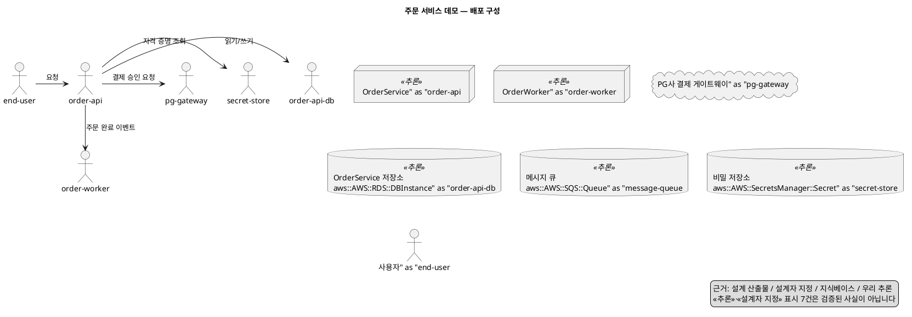

# 끝에서 끝까지 — 설계도에서 배포 다이어그램까지 (2026-07-23)

앱 계층 P1~P3이 실제로 이어지는지를 예제 하나로 보입니다. **아래 출력은 전부
그대로 실행해 받은 것**이고, 마지막 절에는 **틀린 입력에서 무엇이 나오는지**도
같이 담았습니다 — 잘 되는 경우만 보이면 이 사슬의 성격이 안 보입니다.

```bash
uv run python -c "
import json
from appkb.contract import validate_design
from appkb.diagram import render
from appkb.verify import verify_plan, verify_diagram, unhedged_claims
from nim_agent.design_tools import compose, _render_plan_text

design = json.load(open('appkb/examples/order-demo.json', encoding='utf-8'))
print(validate_design(design) or '계약 통과')
plan = compose(design)
print(_render_plan_text(plan))
uml = render(plan)
print(uml)
print(verify_plan(plan), verify_diagram(plan, uml), unhedged_claims(plan))
"
```

에이전트로 같은 것을 하려면(`.env` 필요):

```bash
uv run python -m tools.agent_probe --only DS1
```

---

## 1단계 — 입력: 설계 산출물 JSON

`appkb/examples/order-demo.json`. **PlantUML이 아니라 JSON을 받습니다** — 상류
설계 에이전트가 내는 형식이고, 다이어그램은 그 표현일 뿐입니다.

```
이름: 주문 서비스 데모
컴포넌트: ['order-api', 'order-worker']
외부 시스템: ['pg-gateway']
  - api-1    openapi   componentId=order-api · 경로 2개
  - er-1     er        engineHint=postgresql · 엔티티 2개
  - class-1  class     클래스 4개
  - seq-1    sequence  참여자 4 · 메시지 3
요구사항: {'provider': 'aws', 'region': 'ap-northeast-2',
          'expectedConcurrentUsers': 200, 'multiZone': True}
```

계약은 `appkb/schema.json`. 핵심은 **조인이 명시 id로만** 된다는 것입니다 —
네 산출물이 같은 것을 다른 이름으로 부르므로(`OrderService`/`order-api`/`주문 서비스`)
이름 매칭은 하지 않습니다.

## 2단계 — 계약 검증

```
결과: 통과 (문제 0건)
```

## 3단계 — 배포 계획

**줄마다 근거가 붙습니다.** 이게 이 사슬의 본체입니다.

```
[사용자] 1개
  - 사용자 (end-user)
      · [설계 산출물] 시퀀스의 actor

[직접 배포] 2개
  - OrderService (order-api) ⚠
      · [우리 추론] OpenAPI 산출물이 있어 HTTP 서비스로 봄
      · [설계 산출물] 시퀀스에서 actor가 직접 호출 — 공개 노출
      · [지식베이스] aws ap-northeast-2 t3a.medium 2 vCPU / 4.0 GiB · $0.0468/h
      · [우리 추론] 동시 사용자 200명 기준 vCPU 2·메모리 4GiB 이상으로 잡음
                    (지식베이스 근거가 없는 추정)
      · [지식베이스] 버스트 인스턴스 — CPU 크레딧이 소진되면 baseline 성능으로 떨어집니다.
  - OrderWorker (order-worker) ⚠
      · [우리 추론] 비동기 메시지의 수신자라 워커로 봄
      · [지식베이스] aws ap-northeast-2 t3a.medium 2 vCPU / 4.0 GiB · $0.0468/h
      …

[관리형 서비스] 3개
  - OrderService 저장소 (order-api-db) ⚠ → aws::AWS::RDS::DBInstance
      · [우리 추론] 엔티티 2개를 소유(Order, OrderItem) → 영속 저장소 필요
      · [지식베이스] svcmap: app::relationalDatabase → aws::AWS::RDS::DBInstance
  - 메시지 큐 (message-queue) ⚠ → aws::AWS::SQS::Queue
      · [우리 추론] 시퀀스에 비동기 메시지가 있어 큐가 필요하다고 봄
      · [지식베이스] svcmap: app::messageQueue → aws::AWS::SQS::Queue
  - 비밀 저장소 (secret-store) ⚠ → aws::AWS::SecretsManager::Secret
      · [우리 추론] OpenAPI에 securitySchemes가 있어 자격 증명 보관이 필요하다고 봄
      · [지식베이스] svcmap: app::secretStore → aws::AWS::SecretsManager::Secret

[외부 시스템] 1개
  - PG사 결제 게이트웨이 (pg-gateway)
      · [설계 산출물] 설계가 외부 시스템으로 선언

[연결] 5개
  order-api → order-api-db : 읽기/쓰기          [우리 추론]
  order-api → secret-store : 자격 증명 조회      [우리 추론]
  order-api → pg-gateway   : 결제 승인 요청      [설계 산출물]
  order-api ⇢ order-worker : 주문 완료 이벤트    [설계 산출물]
  end-user  → order-api    : 요청                [설계 산출물]

※ 관리형 서비스 가격은 이 데이터셋에 없어 값이 붙지 않습니다.
  **합계를 내지 않습니다** — 값 없는 것을 0으로 두면 실제보다 낮아집니다.

⚠ 위 7건(⚠ 표시)은 **설계 신호에서 우리가 추론한 것**이거나 설계자가 지정한
  것이며, 검증된 사실이 아닙니다.
```

### 신호가 어디서 왔는지

| 결과 | 어느 산출물의 무엇에서 | 어느 KB를 거쳐 |
|---|---|---|
| `order-api`가 HTTP 서비스 | OpenAPI 산출물의 존재 | — (추론) |
| `order-worker`가 워커 | 시퀀스의 `async: true` 수신자 | — (추론) |
| 저장소가 필요 | ER의 `ownerComponentId` | svcmap `app::relationalDatabase` |
| 저장소가 **RDS** | `engineHint: postgresql` + `provider: aws` | svcmap → 벤더 타입 |
| 큐가 필요 | 시퀀스의 `async: true` | svcmap `app::messageQueue` |
| 비밀 저장소 | OpenAPI `securitySchemes` | svcmap `app::secretStore` |
| 공개 노출 | 시퀀스의 `actor` | — (설계가 말함) |
| `t3a.medium $0.0468/h` | `requirements.provider/region` | costkb |
| 버스트 경고 | 위 스펙 | perfkb |

**앱 계층과 인프라 계층이 만나는 지점이 4행**입니다 — ER 소유라는 설계 사실이
`app::relationalDatabase`를 거쳐 `aws::AWS::RDS::DBInstance`가 됩니다.

## 4단계 — PlantUML



`<<추론>>`이 **그림 안에** 있는 게 요점입니다 — 범례에만 적으면 부족합니다,
그림은 잘려서 돌아다닙니다.

## 5단계 — 자체 검증

```
계획 정합성   : 통과
그림 대조     : 통과
근거 없는 추론: 없음

노드 7 · 선 5 · 유보 7 · 미결 0
```

**그림 대조**는 우리가 낸 PlantUML을 되파싱해 계획과 맞춰 봅니다 — 계획에 있는데
그림에 없거나, 계획에 없는데 그림에 생긴 것을 잡습니다. 만들자마자 제 코드의 버그
둘을 잡았습니다(하이픈 id가 PlantUML에서 쪼개진 것, 동기 화살표가 정규식에서
빠진 것). 둘 다 **그림이 조용히 작아지는** 종류라 눈으로는 안 걸립니다.

---

## 틀린 입력에서 무엇이 나오나 — 여기가 더 중요합니다

### A. 클래스 다이어그램만 준 경우

```
[직접 배포] 1개
  - OrderService (order-api) ⚠
      · [우리 추론] 배포 형태를 정할 신호가 설계에 없음

[답하지 못한 것] 1건
  - order-api: OpenAPI도 비동기 수신도 없어 배포 형태를 정하지 못했습니다
```

**"클래스 다이어그램만으론 배포를 정할 수 없다"**를 실제로 지킵니다. 그럴듯한
구성을 지어내지 않고 무엇이 부족한지 말합니다.

### B. 요구사항(provider·region)이 빠진 경우

```
컴퓨트 노트: (단가 줄이 아예 없음)
관리형 첫 노드: 후보 9개
※ 프로바이더가 없어 단가·리전 조인을 하지 않았습니다 — 임의로 고르지 않습니다
```

프로바이더를 모르면 **후보 9개를 그대로 보여줍니다.** 하나를 임의로 고르는 것이
이 저장소가 막아 온 실패입니다(실측에서 라우팅 변수가 "프로바이더를 밝혔는가"로
확인된 것과 같은 결).

### C. 계약을 어긴 경우 — `componentId` 오타

```
[참조] api-1: componentId 'order-apii'가 components에 없다
compose 결과 노드 수: 0
```

**계획을 아예 만들지 않습니다.** 짐작으로 이어 붙이면 그 짐작이 그림에 상자로
남는데, 그림은 원본보다 믿음직해 보입니다.

### D. 모르는 `engineHint`

```
아키타입: app::relationalDatabase
미결: order-api: engineHint 'neo4j'를 아는 개념으로 옮기지 못해 관계형으로 가정했습니다
```

가정은 하되 **가정했다고 말합니다.** 조용히 관계형으로 몰면 그래프 DB가 필요한
앱에 RDS가 붙습니다.

### E. `redis` 힌트

```
아키타입: app::keyValueCache → aws::AWS::ElastiCache::CacheCluster
```

힌트가 아키타입을 바꿉니다 — 관계형이 기본값이 아닙니다.

---

## 이 예제가 보이는 것

| | |
|---|---|
| **잇는다** | 설계 산출물 → 아키타입 → `app::` 개념 → 벤더 타입 → 단가·성능 경고 |
| **가른다** | 설계가 말한 것 / 설계자가 지정한 것 / KB가 답한 것 / **우리가 추론한 것** |
| **안 한다** | 합계 · 임의 선택 · 신호 없는 추측 · 계약 위반 입력 처리 |
| **검사한다** | 계획 정합성 · 그림 대조 · 근거 없는 추론 |

남은 한계도 그대로입니다 — **관리형 서비스 가격이 0건**이라 비용은 컴퓨트만
나오고, **아키타입 분류는 영원히 `inferred`**입니다.
