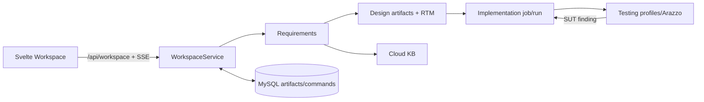

# EasyDep 코드베이스 지도

이 문서는 현재 저장소의 실제 진입점과 호출 경계를 빠르게 찾기 위한 제출용 지도다. 생성된 앱, `.easydep/` 실행 산출물, 로컬 캐시·가상환경은 이 지도에서 제외한다.

## 가장 먼저 볼 곳

| 목적 | 경로 | 실제 책임 |
|---|---|---|
| 서버 진입 | [`server.py`](../server.py) | FastAPI lifespan에서 DB 준비 뒤 `workspace_service.startup()`을 호출하고 artifact, implementation, Workspace router를 연결한다. |
| Workspace HTTP | [`app/workspace/api.py`](../app/workspace/api.py) | `/api/workspace` 요청·SSE·현재 Testing 결과 투영. 작업 자체는 service에 위임한다. |
| 단계 조정 | [`app/workspace/service.py`](../app/workspace/service.py) | command dispatch, checkpoint/retry, stop, 자동 기술 수리와 Requirements/Design/Implementation/Testing handoff. |
| 상태 저장 | [`app/workspace/repository.py`](../app/workspace/repository.py), [`app/repositories/artifact_repository.py`](../app/repositories/artifact_repository.py) | command/timeline event와 버전된 stage artifact의 서로 다른 DB 경계. requirements/design checkpoint는 SQL saver의 `AgentCheckpoint`/blob/write와 `graph_type`으로 분리되고, Testing checkpoint는 command payload, implementation evidence는 run에 별도로 남는다. artifact version과 어느 것도 동의어가 아니다. |
| 브라우저 Workspace | [`frontend/src/routes/workspace/+page.svelte`](../frontend/src/routes/workspace/+page.svelte) | API 조회·SSE 연결·명령 제출·중단과 현재 산출물/Testing UI 조립. |

## 단계별 실제 흐름

1. **Requirements** — [`app/requirements/orchestration/service.py`](../app/requirements/orchestration/service.py)에서 신규 분석은 [`graph.py`](../app/requirements/orchestration/graph.py)의 `start_analysis`를, answer/edit/resource가 있는 기존 분석은 `resume_analysis`를 호출한다. retry와 revision은 각각 `retry_requirements_analysis`/`revise_requirements_analysis` 경로를 사용하며, 분석 결과는 stage artifact로 저장한다. resource 입력은 [`app/requirements/resources/`](../app/requirements/resources/)에서 구조화하며 Cloud KB의 공개 표면을 이용한다.
2. **Design** — Workspace dispatch가 [`app/design/service.py`](../app/design/service.py) 및 `design_graph`를 통해 design graph의 start/resume/retry를 호출한다. [`app/design/`](../app/design/)의 artifact·validation·session 서비스는 requirements를 클래스/시퀀스/OpenAPI/배포 설계로 연결하고 stage artifact를 저장한다. RTM은 `build_design_rtm`과 cascade가 상태에서 파생하는 연결 행렬이며, persisted artifact trace projection과 구별한다. Workspace는 이 결과와 공개 action만 다음 단계에 넘긴다. 세부 서비스는 [`app/design/services/`](../app/design/services/)에 있다.
3. **Implementation** — [`app/implementation/application/jobs.py`](../app/implementation/application/jobs.py)가 job 수명주기를 소유하고, [`prototype.py`](../app/implementation/application/prototype.py)의 `run_phase`가 실행 phase를 시작한다. deterministic scaffold는 [`generation/`](../app/implementation/generation/), owner `TaskSpec`/RTM 계획은 [`planning/design_context.py`](../app/implementation/planning/design_context.py), GLM/OpenHands adapter와 owner/unit 검사는 [`agents/`](../app/implementation/agents/), owner 순서·repair·completion과 final integration은 [`workflows/`](../app/implementation/workflows/)에 있다. Linux runner 경계는 [`runtime/`](../app/implementation/runtime/)이다.
4. **Testing** — [`app/testing/service.py`](../app/testing/service.py)가 implementation artifact에서 `TestingInput` snapshot/checkpoint를 만들고 결과 공개를 조정한다. [`runtime/verification.py`](../app/testing/runtime/verification.py)의 `run_verification_graph`가 graph를 실행하며 [`graphs/testing_graph.py`](../app/testing/graphs/testing_graph.py)은 START에서 dynamic functional과 static verification을 병렬로 fan-out한 뒤 join한다. Dynamic functional은 [`nodes/dynamic_functional.py`](../app/testing/nodes/dynamic_functional.py), Arazzo 계획/실행은 [`utils/arazzo_planner.py`](../app/testing/utils/arazzo_planner.py)·[`utils/arazzo_executor.py`](../app/testing/utils/arazzo_executor.py), static/package/IaC는 `nodes/static_verification.py`와 `utils/`에 있다. Testing report는 다시 Workspace command result projection으로 보인다.
5. **Feedback and repair** — 질문·자유 피드백의 contract는 [`app/workspace/conversation/`](../app/workspace/conversation/)과 [`actions.py`](../app/workspace/actions.py)에 있고, 기술적 Testing finding은 기존 implementation owner repair/checkpoint를 통해 재검증된다. 사용자 선택이 필요한 typed question과 기술 retry를 혼동하지 않는 것이 중요하다.

## 산출물, DB, 추적성

- [`app/db/models.py`](../app/db/models.py)는 `WorkspaceCommand`, `ArtifactVersion`, `ArtifactFile` 등 영속 모델을 둔다. command/event DB 상태, versioned artifact stage snapshot, graph/run checkpoint는 역할이 다르므로 저장소 함수로만 읽기/쓰기를 경계한다.
- [`app/repositories/artifact_repository.py`](../app/repositories/artifact_repository.py)는 app별 artifact version/file snapshot을 관리한다. [`app/artifacts_api.py`](../app/artifacts_api.py)는 그 HTTP 투영이다.
- [`app/artifact_trace.py`](../app/artifact_trace.py), [`app/artifact_trace_projection.py`](../app/artifact_trace_projection.py), [`app/artifact_trace_service.py`](../app/artifact_trace_service.py)는 artifact/RTM 추적 투영 경계다.
- Implementation run의 상세 evidence, task result, source snapshot은 실행별 `.easydep/implementation-runs/`에 생긴다. 이는 DB artifact를 직접 고치는 장소가 아니며, 재개 시 app/job/run/checkpoint 일치를 먼저 확인해야 한다.

## Cloud KB와 delivery

- [`app/cloudkb/`](../app/cloudkb/)는 지역·가격·성능·provider 사실을 제공한다. requirements/design/Workspace는 공개 agent API/catalog을 소비하며, KB가 상위 단계 내부를 import하지 않는 경계를 유지한다.
- [`app/implementation/delivery/`](../app/implementation/delivery/)는 Docker/IaC/package/verification renderer를 둔다. CSP provision 명령은 별도 운영 범위이며 ordinary local verification과 구분한다.

## Frontend 연결

- Workspace route는 [`frontend/src/routes/workspace/+page.svelte`](../frontend/src/routes/workspace/+page.svelte), API client는 [`frontend/src/lib/api.ts`](../frontend/src/lib/api.ts), timeline reconciliation은 [`workspace-timeline.ts`](../frontend/src/lib/workspace-timeline.ts)다.
- 주요 화면 조립은 `components/ArtifactPane.svelte`, `ChatTimeline.svelte`, `Composer.svelte`, `StageRail.svelte`다. Testing view는 `TestingResultsPanel.svelte`와 [`testing-results.ts`](../frontend/src/lib/testing-results.ts)를 사용한다.
- `DeploymentPreferencesCard.svelte`는 `CloudRegionMap.svelte`를 동적으로 import하고, `ReadOnlySourceViewer.svelte`는 Monaco를 동적으로 import한다. 정적 grep만으로 이 둘 또는 map 하위 컴포넌트를 미사용으로 판단하면 안 된다.

## 중단과 재개

- `POST /api/workspace/apps/{app_id}/commands`는 [`app/workspace/api.py`](../app/workspace/api.py)의 request 검증 뒤 [`WorkspaceService`](../app/workspace/service.py)에 command를 queue한다. 화면은 command snapshot과 SSE를 병합한다.
- stop은 API→[`repository.request_stop`](../app/workspace/repository.py)로 durable marker를 먼저 남긴다. 실행자는 안전한 경계에서 이를 확인하여 `CANCELLED`로 끝내므로, 단순히 UI card를 숨기거나 process 상태만 바꾸어서는 안 된다.
- 서버 시작의 [`WorkspaceService.startup`](../app/workspace/service.py)는 저장된 interrupted Testing checkpoint와 `_technical_repair_retry`가 기록된 non-interactive technical retry를 선택적으로 다시 등록한다. 재개는 같은 app/job/run/checkpoint의 대응을 확인한 뒤 사용하며, 새로운 전체 실행을 임의 생성하는 경로가 아니다.

## 테스트와 운영 스크립트

- Python regression은 [`tests/`](../tests/)에 기능 경계별로 있다. 예: Workspace는 `tests/test_workspace_service.py`, implementation planning은 `tests/test_backend_owner_planning.py`, operation contract는 `tests/test_generated_operation_contracts.py`, Arazzo는 `tests/test_arazzo_planner.py`·`tests/test_functional_plan.py`.
- Frontend lightweight test는 [`frontend/tests/`](../frontend/tests/)이며 `frontend/package.json`의 `test` script가 실행한다.
- 기본 개발 시작은 [`scripts/run-easydep.ps1`](../scripts/run-easydep.ps1); server-only 진입은 `python -m uvicorn server:app`이다. bootstrap/deploy/provision/teardown/AKS 및 canary script의 목적은 [`scripts/README.md`](../scripts/README.md)와 각 script header를 우선 확인한다.

## 동적 참조와 정리 시 주의

- `WorkspaceAction`/offered action은 [`app/workspace/contracts.py`](../app/workspace/contracts.py)·[`actions.py`](../app/workspace/actions.py)·`service.py`를 함께 봐야 한다. UI offer만 바꾸어 retry/stop 의미를 바꾸지 않는다.
- Runner hook, task check tool, frontend dynamic import, persisted checkpoint/result keys는 문자열 또는 런타임 주입으로 참조될 수 있다. 삭제 전 `rg` 외에 실행 경계와 저장된 contract를 확인한다.
- 이전 읽기 전용 감사에서 확인된 낮은 위험 정리 후보는 (a) 어떤 route에서도 import되지 않는 legacy raw-report UI [`frontend/src/lib/components/TestingResultPanel.svelte`](../frontend/src/lib/components/TestingResultPanel.svelte), (b) source/config 참조가 없는 `frontend/package.json`의 `mode-watcher` 의존성이다. 둘 다 제거 전 frontend build/check를 수행해야 한다.
- `scripts/restore_checkpoint_*.py`, `scripts/export_*evidence.py`, `scripts/report_openhands_harness.py`, `scripts/run_implementation_runner_preflight.py`는 정적 직접 참조가 적지만 수동 운영 도구일 수 있다. 사용 이력을 확인하기 전 삭제하지 않는다.

## 확인 필요

- requirements/design 일부 서비스의 내부 세부 호출은 여러 artifact 유형과 checkpoint 상태에 따라 달라진다. 변경 전에는 해당 Workspace action의 `stage/status/payload/result`와 현재 service dispatch branch를 함께 추적한다.
- 오래된 `docs/archive/`의 과거 `app/core/...` 경로는 현재 실행 구조의 근거로 사용하지 않는다.
