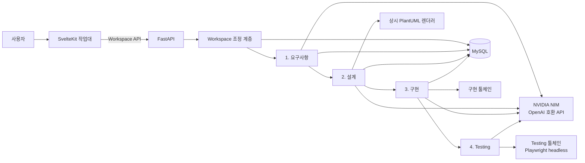
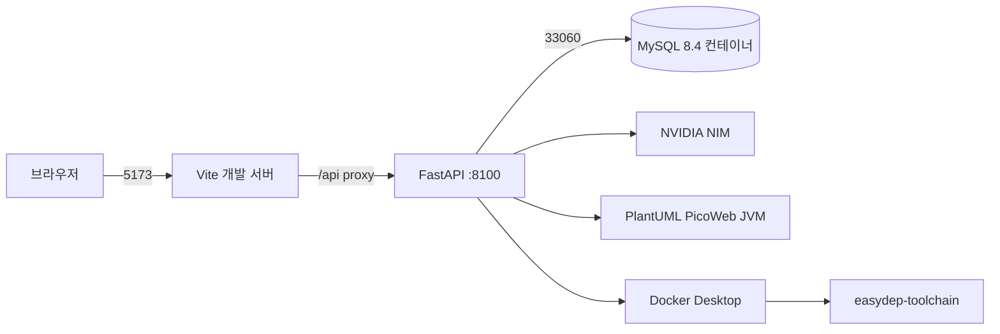

# EasyDep 현재 시스템 구성

> 기준일: 2026-09-02
>
> 기준 커밋: `41912c5`
> 목적: 계획이나 과거 실험이 아니라, 현재 코드가 실제로 어떻게 연결되어 있는지 빠르게 이해한다.

필드별 JSON 타입과 단계 내부의 세부 순서는
[전체 실행 흐름과 데이터 계약](system-flow.md)에 있다. 이 문서는 시스템 전체의 구성과 각
부분의 책임을 설명한다.

## 1. 한눈에 보는 구조

EasyDep은 사용자의 자연어 요구사항을 받아 요구사항 분석, 설계, 구현, 테스트를 순서대로
실행한다. 단계 순서는 코드가 정하며, LLM은 각 단계 안에서 자연어 해석이나 코드 작성을
담당한다.



핵심 구성 요소는 다음과 같다.

| 구성 요소 | 위치 | 책임 |
|---|---|---|
| 작업대 UI | `frontend/` | 앱 생성, 대화, 단계 진행, 산출물·진행 중 소스 조회 |
| FastAPI 진입점 | `server.py` | DB·BERT·PlantUML·worker 준비와 HTTP router 조립 |
| Workspace | `app/workspace/` | 화면 명령을 단계 호출로 바꾸고 상태·이벤트·자동 진행을 관리 |
| 요구사항 | `app/requirements/` | 요구사항 정제, FR/NFR 분류, 액터·유스케이스·상세 명세 생성 |
| 설계 | `app/design/` | 클래스·시퀀스·API·ERD·배포 모델 생성 |
| 구현 | `app/implementation/` | 설계를 소스, 테스트, Docker와 OpenTofu 파일로 변환 |
| Testing | `app/testing/` | 완성된 앱의 배포 정적 검사와 거시적 통합·E2E 검사 |
| 저장소 | `app/repositories/`, `app/db/` | 앱·명령·산출물 버전·체크포인트를 MySQL에 저장 |
| 클라우드 지식 | `app/cloudkb/` | CSP 리전, VM 가격·성능, 리소스 연결 규칙 제공 |
| 공통 계측 | `app/metrics/` | LLM 호출 시간, 토큰, 실패 위치 기록 |

## 2. 개발 환경에서 실행되는 프로세스

`scripts/run-easydep.ps1`은 개발에 필요한 구성 요소를 한 번에 준비한다.



| 주소·포트 | 기본값 | 설명 |
|---|---:|---|
| 개발 UI | `http://127.0.0.1:5173/` | Vite hot reload 서버 |
| 백엔드 API | `http://127.0.0.1:8100/` | FastAPI와 `/docs` |
| 개발 MySQL | `127.0.0.1:33060` | 컨테이너 내부 3306을 호스트에 공개 |
| 배포용 runtime | 컨테이너 8000 | 빌드된 UI와 API를 FastAPI 한 프로세스가 제공 |

개발 UI는 백엔드 주소를 직접 하드코딩하지 않는다. 브라우저는 같은 origin의 `/api`를
호출하고, Vite가 `EASYDEP_API_ORIGIN`으로 받은 FastAPI 주소에 전달한다. 백엔드 포트를
바꾸어 실행해도 스크립트가 이 값을 함께 바꾼다.

첫 실행 또는 서버 재시작 직후에는 DB 준비와 BERT 모델 로딩 때문에 UI가 즉시 열리지 않을
수 있다. 실행 스크립트는 FastAPI의 `/api/health`가 준비된 다음 Vite를 시작하고, UI와
Workspace API가 모두 응답한 뒤 `Ready`를 출력한다.

개발 중에는 Python과 Vite가 호스트에서 실행되므로 백엔드·프론트엔드 파일을 수정하면 hot
reload로 바로 확인할 수 있다. MySQL과 생성물 검사 도구만 Docker를 사용한다.

## 3. 사용자가 보는 실행 흐름

프론트엔드의 공식 실행 경로는 `/api/workspace`이다. 단계별 내부 함수를 브라우저가 직접
호출하지 않는다.

```text
앱 생성
  → 요구사항 분석 명령
  → 요구사항 검토·질문
  → 설계 시작
  → 설계 산출물별 검토
  → 구현 시작과 외부 전송 승인
  → 구현 진행 중 소스 조회
  → 구현 완료
  → Testing 시작
  → 결과와 실패 위치 확인
```

Workspace는 한 번의 사용자 행동을 `workspace_commands` 행으로 저장한다. 백그라운드 worker가
명령을 선점해 해당 단계의 공개 함수를 호출하고, 진행 내용은 SSE(Server-Sent Events)로
브라우저에 전달한다. 한 앱에서는 실행 중인 명령을 동시에 두 개 만들지 않는다.

주요 API는 다음과 같다.

| API | 역할 |
|---|---|
| `POST /api/workspace/apps` | 앱을 만들고 최초 요구사항 분석 시작 |
| `GET /api/workspace/apps/{app_id}` | 현재 단계, 명령, 선택지와 산출물 상태 복원 |
| `POST /api/workspace/apps/{app_id}/commands` | 메시지, 진행, 수리, 구현 승인, Testing 시작 |
| `GET /api/workspace/apps/{app_id}/events` | 진행 이벤트를 SSE로 조회 |
| `GET /api/apps/{app_id}` | 저장된 요구사항·설계 산출물 조회 |
| `GET /api/implementation/apps/{app_id}/jobs/{job_id}/live` | 구현 중 파일 목록 조회 |
| `GET /api/implementation/apps/{app_id}/download` | 최종 구현 파일 ZIP 다운로드 |

## 4. 네 단계의 책임

### 4.1 요구사항

입력은 애플리케이션 설명과 선택적인 CSP·리전·예산·추가 제약이다. 내부에서는 다음 작업을
순서대로 수행한다.

```text
원문 확장·정제
  → FR/NFR 분류
  → 클라우드 입력 분석
  → 액터와 유스케이스
  → 유스케이스 상세 명세
  → include·extend 관계
  → 유스케이스 다이어그램
```

- LLM은 자연어 정제, 액터·유스케이스·시나리오와 관계 제안을 담당한다.
- BERT는 FR/NFR 분류를 보조한다.
- 일반 코드는 ID 연결, 요구사항 누락, 단계 번호, 관계 대상과 리소스 입력을 검사한다.
- 실행 순서는 `app/requirements/stage_registry.py`의 `PIPELINE`이 기준이다.
- LangGraph 체크포인트를 MySQL에 저장하므로 같은 앱에서 실패 지점부터 재개할 수 있다.

주요 산출물은 구조화 요구사항, capability contract, resource intake, resource spec,
use-case specification과 use-case PlantUML이다.

### 4.2 설계

설계는 다음 다섯 산출물을 고정된 순서로 만든다.

| 순서 | 산출물 | LLM과 일반 코드의 역할 |
|---:|---|---|
| 1 | 클래스 | LLM이 BCE 클래스·operation·호출 관계를 제안하고 코드가 타입과 일반 규칙을 검사 |
| 2 | 시퀀스 | 클래스의 collaboration을 코드가 유스케이스별 호출 순서로 변환 |
| 3 | API | LLM이 HTTP 계약을 제안하고 코드가 Control 연결·타입을 정리해 OpenAPI 생성 |
| 4 | ERD | 클래스의 Entity를 코드가 논리 테이블·관계로 변환; 피드백 수정에만 LLM 사용 가능 |
| 5 | 배포 | LLM이 WorkloadGraph를 제안하고 코드가 ResourcePlan과 CSP별 구조를 생성 |

LLM에게 PlantUML이나 OpenAPI 전체 문자열을 기준 데이터로 맡기지 않는다. 편집 가능한 Pydantic
모델을 저장하고, 같은 모델에서 PlantUML·OpenAPI를 코드로 만든다. 각 산출물은 저장 후 검토
지점을 거치며 설계 체크포인트도 MySQL에 저장된다.

클래스 생성은 하나의 큰 응답으로 끝내지 않는다. 전체 구조, 실행 묶음별 operation과 호출
계획, 작은 선택 작업으로 나누며 독립 작업은 설정된 범위에서 병렬 실행한다. 통과한 단위는
프로세스 메모리 cache에 보관해 같은 실행에서 중복 LLM 호출을 줄인다.

### 4.3 구현

구현은 설계 JSON을 읽어 실행 가능한 애플리케이션을 만든다.

```text
설계 준비 상태 검사
  → 자체 Python scaffolder로 Java·persistence 골격 생성
  → OpenAPI client와 프론트엔드 골격 생성
  → 기능 단위 작업 계획
  → OpenHands 코딩 작업
  → 작업별 compile·단위·작은 통합 테스트
  → 최종 연결·container·schema 검사
  → Docker·cloud-init·OpenTofu 파일 생성
  → MySQL에 파일 snapshot 저장
```

`puml2code-bce`는 사용하지 않는다. 클래스·ERD의 typed 모델을 Python 코드 생성기가 직접
읽으므로 BCE 골격 생성 때문에 Node.js가 필요하지 않다. 다만 EasyDep UI와 생성 앱의 React
프론트엔드를 빌드하기 위해 Node.js는 계속 사용한다.

LLM 코딩 작업은 파일 하나가 아니라 같은 기능을 구성하는 Control, Boundary/API, Entity와
테스트를 함께 다룬다. OpenHands가 관련 코드를 조사하고 수정한 뒤, EasyDep이 정한
`run_task_check`로 필요한 compile·test를 실행한다. 실패하면 같은 작업 공간과 수리 이력을
유지한 채 다시 수정한다.

구현 중인 텍스트 파일은 읽기 전용 Monaco viewer에서 볼 수 있다. `.env`, private key,
binary, build 결과와 큰 파일은 노출하지 않는다.

최종 파일은 다음 다섯 종류로 저장된다.

- `SOURCE_CODE`
- `FRONTEND_SOURCE_CODE`
- `TEST_CODE`
- `DEPLOYMENT_FILE`
- `IAC_CODE`

### 4.4 Testing

`app/testing`은 EasyDep 저장소 자체의 pytest가 아니라, EasyDep이 생성한 애플리케이션을
검사하는 제품 단계다.

Implementation이 작업별로 수행한 compile, 단위 테스트, 작은 통합 테스트와 frontend build를
반복하지 않는다. Testing은 여러 구성 요소를 함께 실행해야 확인할 수 있는 항목을 담당한다.

```text
구현 산출물 version ID 고정
  → 한 임시 폴더에 파일 복원·digest 확인
  → 배포 package와 IaC 정적 검사
  → 생성 앱 실행
  → API 통합 흐름 검사
  → 필요한 경우 실제 DOM·JavaScript E2E
  → 하나의 gate report로 집계
```

API 검사는 `httpx`를 우선 사용한다. 실제 DOM, JavaScript, click event와 client routing이
필요할 때만 Playwright의 Chromium headless shell을 사용한다. screenshot이나 픽셀 비교는
하지 않는다.

OpenTofu는 `fmt`, `init -backend=false`, `validate`를 수행한다. 자격 증명을 명시하고
`TESTING_IAC_PLAN=true`로 설정한 경우에만 제한된 plan을 추가할 수 있다. EasyDep은
`tofu apply`를 실행하거나 클라우드 자원을 직접 만들지 않는다.

Testing 입력과 중간 결과는 별도 테이블을 만들지 않고 해당 Workspace command의
`payload.testing_checkpoint`에 저장한다. 따라서 서버가 재시작되어도 같은 명령의 고정된
산출물 버전과 검사 경계에서 재개할 수 있다.

## 5. AI 에이전트와 일반 코드의 관계

현재 시스템은 모든 결정을 하나의 총괄 LLM에게 맡기는 구조가 아니다.

- Workspace가 사용자의 명령과 현재 상태를 보고 다음 실행 단계를 결정한다.
- 요구사항·설계 LLM은 Pydantic 모델에 맞는 제안을 만든다.
- 일반 코드는 타입, ID 연결, 정렬, OpenAPI·PlantUML 투영과 클라우드 규칙을 검사한다.
- 구현의 OpenHands 작업자가 실제 여러 파일을 읽고 코드와 테스트를 수정한다.
- Testing LLM은 요구사항과 OpenAPI에서 거시적 테스트 후보를 만들고, 고정 runner가 실행한다.

즉, **단계 선택은 예측 가능한 코드가 담당하고 각 단계 안의 해석·작성은 전문 작업자가
담당한다.** 현재 가장 일반적인 코딩 에이전트에 가까운 부분은 구현 단계다. 요구사항과 설계는
구조화된 결과를 만드는 전문 LLM 서비스에 더 가깝다.

자동 모드는 별도 파이프라인이 아니다. 백엔드가 현재 상태에서 허용한 일반 선택지 중 다음
행동을 UI가 대신 누른다. 기술 오류는 모드와 관계없이 백엔드가 자동 수리로 이어 간다.

수리 횟수에 시스템 전체의 숫자 상한을 두지는 않는다. 대신 실패 내용, 사용한 전략과 결과
digest를 누적해 같은 후보와 같은 실패를 반복하지 않도록 한다. 한 번의 HTTP 요청, LLM 대화,
도구 실행에는 timeout과 출력 크기 같은 안전 제한이 있다. 요구사항의 뜻, 배포 선택,
자격 증명처럼 코드가 결정하면 안 되는 문제만 사용자에게 묻는다.

## 6. 저장 구조

MySQL은 7개 테이블만 사용한다.

| 테이블 | 저장 내용 |
|---|---|
| `apps` | 앱 ID, 원문 요구사항, 현재 단계, 배포 선택 |
| `artifact_versions` | 요구사항·설계·구현 산출물의 변경 불가능한 버전 |
| `artifact_files` | 구현 산출물 버전에 속한 파일 경로·내용·SHA-256 |
| `workspace_commands` | 사용자 명령, 입력, 현재 상태, 결과와 오류 |
| `agent_checkpoints` | 요구사항·설계 그래프 체크포인트 본문 |
| `agent_checkpoint_blobs` | 체크포인트 상태 값 |
| `agent_checkpoint_writes` | 아직 반영되지 않은 체크포인트 쓰기 |

과거 스키마 migration은 현재 지원하지 않는다. 구조가 바뀌면 개발 DB를 삭제하고 현재 ORM으로
다시 만든다. 자세한 필드와 인덱스는 [MySQL 구조 문서](mysql-architecture.md)에 있다.

MySQL 밖에 남는 상태도 있다.

| 상태 | 위치 | 서버 재시작 뒤 |
|---|---|---|
| Workspace 진행 이벤트 | 프로세스 메모리, 앱당 최대 1,000개 | 사라짐 |
| 클래스 생성 중 preview와 accepted-unit cache | 프로세스 메모리 | 사라짐 |
| 구현 작업 공간과 상태 | `.easydep/implementation-runs/` | 저장된 상태를 확인해 재개 가능 |
| Testing 중간 상태 | `workspace_commands.payload` | 같은 command에서 재개 가능 |
| 최종 산출물 | MySQL | 유지 |

## 7. 다이어그램 렌더링

FastAPI가 시작될 때 PlantUML PicoWeb JVM 하나를 계속 실행한다. 산출물이 저장되면 해당
PlantUML의 SVG와 PNG를 즉시 렌더링해 메모리 cache에 넣는다. 화면의 이미지 요청은 정상
흐름에서 DB나 JVM을 다시 거치지 않고 cache의 bytes를 반환한다.

서버를 재시작하면 이미지 cache는 사라지지만 원본 설계 모델과 PlantUML은 MySQL에 남는다.
기존 산출물을 처음 조회할 때 한 번 다시 렌더링하고 이후 요청부터 cache를 사용한다.
클래스 생성 중 preview도 revision별 SVG를 cache하지만 정식 산출물과 달리 서버 재시작 후에는
복원하지 않는다.

## 8. Docker 이미지와 도구

Dockerfile은 실행 위치에 따라 두 최종 대상을 만든다.

| 대상 | 포함하는 주요 도구 | 사용 위치 |
|---|---|---|
| `toolchain` | JDK 21, Gradle, Node/npm, OpenAPI Generator, OpenTofu, AWS·Azure·GCP provider mirror, Trivy, cloud-init, ShellCheck, PowerShell, Docker CLI, Playwright, Chromium headless shell | 구현 compile·test, 배포 파일 검사와 거시적 DOM·JavaScript E2E |
| `runtime` | FastAPI Python 환경, BERT, PlantUML JRE/JAR, 빌드된 SvelteKit UI | 배포용 EasyDep 서버 |

BERT와 PlantUML은 API runtime에만 둔다. 구현과 Testing은 하나의 툴체인을 공유하되,
구현 작업은 Playwright를 실행하지 않는다. Python 패키지는 `uv`, 프론트엔드 패키지는
변경된 경우에만 `npm ci`로 준비한다.

Playwright는 단순 HTML 문자열 검사 때문에 넣은 것이 아니다. 브라우저에서 실제로 실행되는
JavaScript, event, client routing과 DOM 변경을 확인하려면 브라우저 엔진이 필요하므로 공용
툴체인에 유지하고 Testing 진입점에서만 실행한다.

## 9. 클라우드와 배포 범위

현재 목표는 AWS·Azure·GCP에 배포할 수 있는 Docker-on-VM 산출물을 만드는 것이다.

포함하는 범위:

- VM, 부트 디스크, 네트워크, 서브넷, NIC, 방화벽과 공인 IP
- 요구사항에 근거가 있을 때의 영속 디스크, 관리형 VM 그룹과 로드밸런서
- 애플리케이션 port, health endpoint, 환경변수, 사설 연결과 mount 정보
- Dockerfile, compose, cloud-init, OpenTofu와 사용자용 실행·정리 스크립트
- VM 용량·가격·성능 후보 선택

현재 제외하는 범위:

- Kubernetes
- 서버리스와 관리형 애플리케이션 플랫폼
- VPN과 다중 Region failover
- HTTPS 인증서 발급·갱신과 도메인 관리
- EasyDep이 사용자의 CSP에 직접 `apply`하는 기능

EasyDep은 배포 파일을 생성하고 정적으로 검사한다. 실제 자격 증명을 사용한 배포는 사용자가
생성된 스크립트와 문서를 검토한 뒤 실행한다.

## 10. 현재 알려진 한계

- LLM 출력은 같은 입력과 seed를 사용해도 완전히 같지 않다.
- 최초 서버 시작은 BERT 로딩 때문에 수십 초 걸릴 수 있다.
- 요구사항·설계의 기술 수리는 자동화되어 있지만 의미 선택이나 검토 지점에서는 멈출 수 있다.
- 기존 DB·체크포인트를 새 스키마로 옮기는 migration은 지원하지 않는다.
- 이미지·진행 이벤트·클래스 단위 cache는 메모리 기반이라 서버 재시작 후 다시 만든다.
- Testing은 실제 cloud apply를 하지 않으므로 클라우드 권한·quota·런타임 장애까지 모두
  증명하지 않는다.
- 여러 도메인과 CSP에서의 반복 완주율은 계속 측정해야 하며, 일부 성공 사례만으로 일반적인
  성공을 주장하지 않는다.

## 11. 처음 코드를 읽는 순서

1. `server.py`에서 서버 시작과 router 조립을 본다.
2. `frontend/src/lib/api.ts`에서 화면이 호출하는 API를 본다.
3. `app/workspace/api.py`와 `app/workspace/service.py`에서 명령이 단계로 연결되는 과정을 본다.
4. `app/requirements/stage_registry.py`에서 요구사항 순서를 본다.
5. `app/design/graphs/design_graph.py`와 `subgraphs.py`에서 설계 순서를 본다.
6. `app/implementation/README.md`와 `app/implementation/workflows/`에서 구현 작업과 수리를 본다.
7. `app/testing/service.py`와 `app/testing/runtime/`에서 최종 검사 흐름을 본다.
8. `app/db/models.py`와 `app/repositories/`에서 저장 방식을 본다.

## 12. 실행 명령

개발 환경 전체를 시작한다.

```powershell
powershell -ExecutionPolicy Bypass -File scripts\run-easydep.ps1 -OpenBrowser
```

준비가 끝나면 다음 주소를 사용한다.

- UI: `http://127.0.0.1:5173/`
- API 문서: `http://127.0.0.1:8100/docs`

종료할 때에는 다음 명령을 사용한다. MySQL 데이터 볼륨은 삭제하지 않는다.

```powershell
powershell -ExecutionPolicy Bypass -File scripts\run-easydep.ps1 -Stop
```

문제가 생기면 `.easydep/dev/server.stderr.log`, 최신 Workspace command의 `error`, 해당 단계의
마지막 report 순서로 확인한다. 이미 정상 저장된 산출물이 있으면 전체를 처음부터 실행하지
말고 실패한 단계부터 재개한다.
