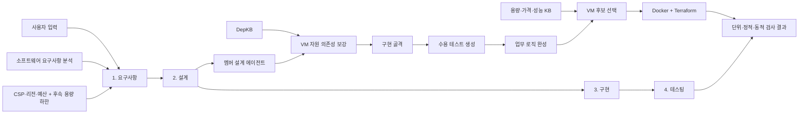
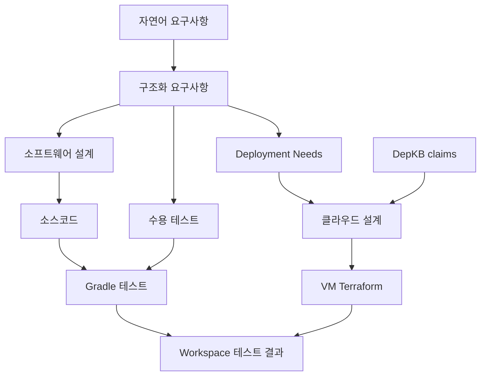
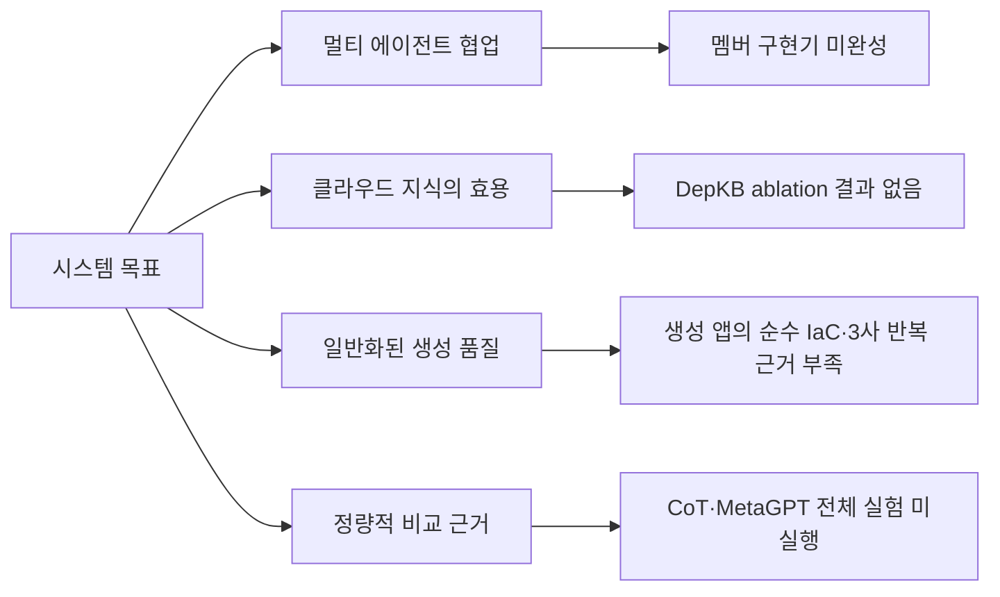

# EasyDep 현재 구조와 부족한 점

> 기준일: 2026-08-15
> 시스템 목표: **멀티 AI 에이전트를 활용한 클라우드 네이티브 애플리케이션 개발 지원**

> 이 문서는 위 기준일의 구현 범위와 검증 근거를 기록한다. 이후 바뀐 프론트엔드 API,
> 실제 입출력 타입, MySQL·체크포인트와 수리 흐름은
> [전체 실행 흐름과 데이터 계약](system-flow.md)을 현재 기준으로 삼는다.

## 한눈에 보기

| 영역 | 현재 상태 | 판정 | 핵심 부족 사항 |
|---|---|---:|---|
| 4단계 파이프라인 | 요구사항 → 설계 → 구현 → 테스팅 연결 | ✅ | 멤버 workflow의 미구현 planner 공백은 임시 LLM으로 제한 보완 |
| 요구사항 분석 | 소프트웨어 요구사항과 클라우드 제약 구조화 | ✅ | 용량 산정에 필요한 트래픽·최소 사양이 자주 미확정 |
| 설계 | 기존 설계 산출물 + 논리 토폴로지·CSP ResourcePlan | ⚠️ | 3사 정적 Plan·중립 앱 runtime 통과. 생성 앱은 AWS 1회만 harness 보정 후 통과 |
| 구현 | 멤버 workflow 호출과 임시 공백 provider 연결 | ⚠️ | BCE·OpenAPI·Gradle 생성기는 Docker 도구와 `/workspace` 경로 계약을 사용 |
| 테스팅 | Gradle 테스트 및 테스트 0개 성공 방지 | ✅ | 더 넓은 운영 품질·보안 검사는 아직 제품 범위 밖 |
| DepKB | AWS·Azure·GCP의 VM 자원 의존성 제공 | ⚠️ | 고정입력 절제 완료, 생성·기능 성공의 소규모 비교가 남음 |
| VM 선택 | 용량 필터 후 가격·성능 추천 및 IaC 반영 gate | ✅ | 실제 처리량·전체 비용과 provider validate는 별도 증거 필요 |
| 여러 입력 실행 | 프론트엔드와 같은 Workspace API 실행기 | ⚠️ | 입력 묶음과 사람용 성공 기준은 정리 작업 뒤 확정 |
| 종단 검증 | 중립 앱 E1·E2 3사 및 수강신청 생성 앱 AWS 기능 검증 | ⚠️ | AWS 생성 앱은 harness 보정 포함. 순수 생성과 Azure·GCP 생성 앱은 미확인 |

범례: ✅ 동작 검증, ⚠️ 구조는 있으나 근거 또는 범위 부족, ❌ 미구현

## 현재 시스템 구조

클라우드 네이티브 기능은 별도 5단계가 아니라 기존 네 단계의 하위 작업으로 들어간다.



### 단계별 provider

| 단계 | 하위 작업 | 현재 기본/실험 provider |
|---|---|---|
| 요구사항 | 자연어 분석 및 클라우드 제약 구조화 | 멤버 에이전트 |
| 설계 | 소프트웨어 설계 | 멤버 에이전트 |
| 설계 | VM 자원 의존성 보강 | 내장 DepKB adapter |
| 구현 | 애플리케이션 골격 | 기본: 멤버 / 현재 비교실험: 명시적 LLM |
| 구현 | 수정 불가능한 수용 테스트 | LLM |
| 구현 | 업무 로직 완성 | LLM |
| 구현 | VM 후보 선택 | 결정론적 선택기 |
| 구현 | Docker 및 VM Terraform | LLM |
| 테스팅 | 생성 애플리케이션 테스트 | 내장 Gradle adapter |

선택한 provider가 실패하면 다른 provider로 자동 전환하지 않는다. 실행 manifest에 실제
provider가 기록되므로 임시 LLM 구현과 멤버 구현 결과를 구분할 수 있다.

## 데이터와 산출물 흐름



프론트엔드에서 시작한 실행은 MySQL의 `apps`, `workspace_commands`, 산출물·공용 checkpoint
테이블에 저장한다. 화면용 진행 이벤트는 bounded 메모리 버퍼를 통해 SSE로 보내며 재시작 뒤
복구하지 않는다. 구현 단계는 동시에 하나만 실행하며 timeout 시 하위 프로세스 트리도 종료한다.

## 요구사항 입력 경계

최초 요청에서 받는 값은 다음으로 제한한다.

- 사용자가 만들려는 앱의 기능·품질 요구사항 문장
- CSP
- Region 또는 지역 표현
- 월 예산과 통화

최소 vCPU와 메모리는 최초 화면에서 받지 않는다. VM 선택에 용량 하한이 필요한 시점의
요구사항 피드백에서 둘 중 하나 이상을 임시로 받는다. 서비스 목적·배포 목적·주요 사용자라는
별도 설문은 두지 않으며, 필요한 내용은 기능 요구사항 자체에서만 분석한다.

고가용성 여부, Zone 수, VM 수, 자동 복구 사용 여부를 선호도 설문으로 받지 않는다. 요구사항에
단일 VM 또는 단일 Zone 장애 중 업무 지속 같은 필수 목표가 있으면 CSP 관리형 VM 그룹·서로
다른 Zone 둘 이상·로드밸런서로 내리고, 근거가 없으면 단일 VM 최소 후보를 선택한다. 단순
다중 Zone 배치와 Zone 장애 생존은 구분한다. 다중 Region 요구는 Region별 그룹과 전역
라우팅·데이터 복구 계약이 없으므로 현재 단일 Region으로 축소하지 않고 `unsupported`로 남긴다.

## 클라우드 범위

### 포함

- AWS, Azure, GCP
- Docker-on-VM 배포
- VM, 부트 디스크, NIC, 네트워크, 서브넷, 공인 IP, 방화벽
- 필수 장애 허용 요구가 있을 때 단일 Region의 CSP 관리형 VM 그룹·다중 Zone 배치·자동 복구·로드밸런서 적용
- 영속 데이터 디스크는 요구될 때만 추가
- HTTP 진입점, health endpoint, 애플리케이션 포트
- VM 용량·가격·성능 후보 선택

### 제외

- Kubernetes 기반 배포
- VPN
- 서버리스 및 관리형 애플리케이션 플랫폼
- 다중 Region 생성·전역 ingress·Region 간 데이터 복제와 failover
- 영속 Workload HA와 관리형 데이터베이스
- HTTPS/TLS, 인증서, 도메인 검증과 TLS reverse proxy
- 모든 CSP 리소스를 포괄하는 범용 지식베이스

이 제한은 학부 졸업과제에서 검증 가능한 범위를 확보하기 위한 의도적 결정이다.

## 현재 검증된 것

P1-GCP 무상태 변환 API 사례에서 다음 로컬·정적 결과를 확인했다.

| 항목 | 결과 |
|---|---:|
| 4단계 완료 | 통과 |
| Gradle 수용 테스트 | 통과 |
| Docker build 및 health | 통과 |
| 업무 API acceptance | 2/2 통과 |
| OpenTofu 검증 | 통과 |
| IaC 의미 검증 | 12/12 통과 |
| 불필요한 영속 데이터 디스크 | 없음 |
| 순환복잡도 | 평균 2.36, 최대 6, 10 초과 함수 0개 |
| 실험 적격성 | `experimentEligible=true` |

이 결과는 **종단 실행 가능성**은 보여주지만 시스템의 일반적 우수성을 입증하지는 않는다.

추가로 도메인 중립 App–State 앱은 AWS·Azure·GCP에서 다음 경로를 각 1회 완료했다.

- E1: 사설 PostgreSQL 연결, CSP traffic filter 개입·복원, 별도 data disk, State VM 재기동 뒤 보존
- E2: 과거 AWS ALB–ASG, Azure Standard LB–VMSS, GCP Application LB Backend Service–MIG의 App 장애 감지·관리형 복구
- E3: State VM 교체, 기존 data disk 재연결, 새 사설 endpoint 주입, App image 재빌드 없이 기존 값 조회
- 모든 실행: `apply → ready → 업무 probe → fault/restart → 재확인 → cleanup 잔여 0`

현재 ResourcePlan은 AWS Network Load Balancer, Azure Load Balancer, GCP Regional External
Passthrough Network Load Balancer를 선택한다. 2026-08-17에 같은 중립 최소 앱과 동일 판정 규칙으로
세 경로를 각각 1회 검증했다. TCP 전달, HTTP readiness, 두 backend 도달, backend 프로세스 장애
제외·운영자 복원, 실행 소유 잔여 0은 `observed`다. SLA, 성능, 관리형 VM 자동교체는 여전히
`notMeasured`다.

수강신청 생성 앱의 과거 검증은 AWS에서 HTTPS health, 업무·동시성 13/13, DB 중지 시 503/DOWN,
DB VM 재기동 뒤 영속성 2/2와 실행 소유 잔여 0을 확인했다. 다만 순수 생성 IaC의 EBS
bootstrap 오류를 실험 harness로 보정했으므로 시스템 단독 종단 성공으로 세지 않는다.

## 목표 대비 핵심 부족 사항



### 1. 정식 구현 경로

비교실험은 멤버 구현 provider를 기본으로 사용한다. 명시적인 외부 전송 승인 아래 멤버의
생성·계획·OpenHands 작업·내부 검증을 실행한다. 멤버 workflow가 `COMPLETE`이면 임시
acceptance/logic LLM은 호출하지 않는다. 구현된 planner를 모두 수행한 뒤
`NEEDS_PLANNER`로 남은 공백에만 임시 LLM 경로를 사용하며, 실제 `FAILED`와
`NEEDS_INPUT`은 fallback으로 숨기지 않는다.

### 2. 요구사항 추적성

RTM의 역할은 남아 있지만 다음 연결을 정량적으로 평가하지 않는다.

```text
요구사항 ID → 설계 결정 → 소스/IaC 요소 → 테스트 결과
```

최종 산출물 평가와 별도로, 클라우드 제약이 실제 자원으로 반영됐는지 추적하는 지표가
필요하다.

### 3. 용량 입력과 질문

VM 선택기는 최소 vCPU·메모리 같은 용량 하한이 없으면 추천을 보류한다. 이는 임의 추천을
막는 올바른 동작이다. 현재 자연어에서 용량 하한이 빠지면 최소 vCPU 또는 메모리를 질문하고,
답변 뒤 제약 구조화 작업만 재개해 선택기에 전달한다. 앱 부하에서 하한을 자동 추정하지 않는다.
최초 요청에서는 CSP·리전·월 예산을 구조화 입력으로 받고, vCPU·메모리는 요구사항 피드백에서
둘 중 하나 이상을 받는다. 고가용성 선호나 Zone 수를 사전 질문하지 않고, 요구사항의 장애
허용 목표에서 필요한 가용성 구성을 도출한다.

### 4. DepKB 효과 입증

DepKB는 설계에 사용되며 저장된 동일 LLM 출력의 `full/no-depkb` 고정입력 절제로 9/9 provider
cell의 입력 동일성과 projection 처치 충실도를 확인했다. 다만 다음 생성·기능 비교 결과는 아직 없다.

- EasyDep full과 cloud-KB 미사용 버전의 자원 누락률
- 의존성 edge 정확도와 불필요 자원 수
- IaC 의미 검증 통과율
- CSP별 필수 생성 관계 누락률과 호환성 위반률

P1~P3은 DepKB의 실험군이 아니라 과거 구성요소·smoke 회귀 과제다. 현재의 EasyDep·CoT·MetaGPT·ChatDev
비교는 시스템 전체의 실용 성능을 비교할 수 있지만, 구조·프롬프트·도구·검증·KB가 함께
달라 DepKB 또는 멀티 에이전트 구조의 단독 인과효과를 입증하지 못한다. 이를 위해 같은
EasyDep 실행 경로에서 `no-depkb`, `no-verification` 처치와 단일 클라우드 조건 쌍을 별도로
실행해야 한다.

### 5. 앱과 CSP 일반화

현재 P1-GCP·P1-AWS·P1-Azure에서 동일한 무상태 앱 기능 oracle과 CSP별 정적 의존성 oracle을
통과했다. 또한 중립 E1·E2 앱은 세 CSP의 실제 cloud 경로를 각 1회 통과했고, 수강신청 생성 앱은
AWS에서 harness 보정 뒤 기능·영속성 gate를 통과했다. 이는 개발 관찰이며 반복 비교 결과나
순수 생성 IaC의 3사 성공이 아니다.
다음 과거 사례는 회귀 근거로 보존하되 새 주 비교로 확대하지 않는다.

- P1 무상태 앱: AWS, Azure, GCP
- P2 영속 데이터 앱: AWS, Azure, GCP
- P3 고가용성 앱: AWS, Azure, GCP
- 새 주 비교: E1 단일 앱+영속 상태, E2 CSP 관리형 앱 VM 그룹+LB+같은 상태 Workload
- 용어 전이: D1 제한 수량 예약

### 6. 비교실험 결과

EasyDep, LLM CoT, MetaGPT, ChatDev 실행기는 준비됐다. 그러나 공통 의미 adapter와 반복 실험 결과가
통계가 없으므로 현재는 효용성 주장을 할 수 없다.

핵심 지표는 다음으로 제한한다.

- 종단 성공률과 기능 요구사항 만족률
- IaC 의미 검증 및 의존성 정확도
- 불필요·금지 자원 생성률
- Docker·health·업무 API 통과율
- 순환복잡도 분포
- 실행 시간, LLM 호출 수, 실패율

### 7. 문서 일관성

루트 `README.md`와 문서 색인은 현재 4단계 구조를 기준으로 정리했다. 초기 MySQL 인수인계,
minikube·AKS 요구사항 배포, Kubernetes manifest 생성 및 완료된 병합 계획은 `docs/archive/`로
이동했다. 활성 문서는 이 문서의 상태 요약을 중복하지 않고 연결해서 사용한다.

## 다음 진행 순서

| 우선순위 | 작업 | 완료 기준 |
|---:|---|---|
| 1 | 최소 ResourcePlan·구조도·IaC 공동 생성 | 완료: 3사 구조도·IaC 입력 공유와 HCL·Plan JSON 정적 대조 통과 |
| 2 | E1 종단 | 완료: 중립 앱 3사 cloud 1회, 수강신청 AWS 업무·동시성·영속성 통과. 생성 IaC harness 보정 한계 기록 |
| 3 | E2 App 계층 장애 대응 | 완료: AWS ASG 교체, Azure VMSS 교체, GCP MIG 동일 VM 재기동을 각 1회 관찰. 단일 State VM이라 종단 HA는 아님 |
| 4 | 코드 정리 | 실제 Workspace 경로 밖의 중복 실행기·API·테스트 제거 |
| 5 | 여러 요구사항 실행 | 같은 Workspace API로 입력 묶음을 실행하고 실패 위치와 원시 응답 기록 |

과거 비교실험용 평가 프레임워크는 현재 제품 흐름과 다른 경로를 만들었기 때문에 보류했다.
코드 정리를 먼저 끝낸 뒤, 프론트엔드와 같은 공개 API로 여러 요구사항을 실행한다.

## 실행 시간과 병목 계측

Workspace가 조율하는 각 단계는 UTC 시작·종료 시각과 단조 시계 기반 경과 시간을 기록한다.
요구사항과 설계 단계는 구조화 LLM 호출별 작업명·경과 시간·성공 여부·폴백 여부를,
IaC 단계는 생성·수정·HCL 사전 검사·공급자 초기화·공급자 검증 시간을 각각 기록한다.
실패한 실행도 실패 직전까지의 하위 작업 시간을 보존한다. 따라서 단계 총시간만 비교하지
않고 LLM 대기, 로컬 파싱, 공급자 플러그인 초기화 중 어디에서 시간이 소모됐는지 구분한다.

2026-08-08 P1-Azure 개발 실행(`easydep-full-p1-azure-20260808T040802Z-ae3abb`)에서
관측한 단계 시간은 요구사항 158.68초, 설계 113.83초, 구현 골격 13.73초,
인수 테스트 생성 10.50초, 업무 로직 5.73초, VM 전달 163.71초였다. VM 전달 중 기록된
LLM 생성·수정은 35.66초뿐이어서 나머지 약 128초가 공급자 초기화·검증 경계에 있음을
확인했다. 이후 실행부터 해당 명령도 개별 계측하므로 이 추정치를 직접 관측값으로 대체한다.
이 수치는 개발 병목 탐색 자료이며 아직 방식 간 성능 우열의 근거로 사용하지 않는다.

## 구현 경계와 사용 인터페이스

프론트엔드의 새 종단 실행은 `app/workspace/`의 HTTP API를 기준으로 한다. 구현 단계는 다음
순서다.

```text
소프트웨어·클라우드 설계
→ 애플리케이션 골격
→ 수정 불가능한 수용 테스트
→ 업무 로직
→ VM 후보
→ Dockerfile·Terraform
```

| 위치 | 역할 |
|---|---|
| `app/workspace/` | 프론트엔드 명령, 4단계 전환, 진행 이벤트와 실행 상태 |
| `app/repositories/`, `app/db/` | 산출물·명령·이벤트와 단계별 checkpoint 저장 |
| `app/implementation/` | 구현 IR, 품질 gate, Docker·IaC renderer |
| `app/cloudkb/` | 리소스 의존성·VM 가격·성능 근거 |
| `evaluation/easydep/` | Workspace 공개 API로 요구사항 한 건을 실행하고 원시 응답 저장 |

Workspace API가 프론트엔드의 공식 경로이며, 구현·테스팅 job API는 Workspace 서비스가 단계
내부에서 사용한다. 정확한 요청·응답 스키마는 실행 중인 FastAPI `/docs`와 route 구현을 현재
API의 기준으로 사용한다.

| 메서드와 경로 | 역할 |
|---|---|
| `POST /api/workspace/apps` | 앱 생성과 첫 요구사항 분석 시작 |
| `GET /api/workspace/apps/{app_id}` | 현재 단계, 명령, 이벤트와 산출물 상태 복원 |
| `POST /api/workspace/apps/{app_id}/commands` | 메시지·수리·승인·테스트 명령 제출 |
| `GET /api/workspace/apps/{app_id}/events` | 진행 이벤트를 SSE로 조회 |

필요 도구는 Python 의존성, JDK 21과 Gradle wrapper, Node.js/npm, OpenAPI Generator,
Docker와 OpenTofu다. 생성·검증 도구의 고정 버전과 실제 provider는 run manifest에 남긴다.

## 유지되는 실행 문서

- `app/workspace/README.md`: 프론트엔드 명령과 단계 전환 계약
- `evaluation/easydep/README.md`: 프론트엔드와 같은 공개 API 실행 방법
- FastAPI `/docs`: 현재 HTTP 계약

## 2026-08-15 도메인 중립·수강신청 cloud 확인

아래는 현재 HTTP 전용 범위 결정 전 수행한 TLS 연구 기록이며 생성 범위의 근거로 사용하지 않는다.
직접 TLS는 로컬 중립 앱에서 terminator 제거·복원
개입을 확인했고, 관리형 HTTPS는 AWS ALB 1회, Azure Application Gateway 1회, GCP External
Application Load Balancer 3회에서 backend binding 제거 시 실패와 복원 후 회복을 관찰했다.
DNS 소유권·공개 CA 신뢰·SLA는 측정하지 않았다.

기존 생성 수강신청 E1 앱은 AWS·Azure·GCP 모두에서 동일한 13단계 업무·동시성 오라클,
DB 중단 시 503/DOWN, State VM 재기동 뒤 영속성 2/2를 통과했다. 모든 실행의 소유 잔여는
0이다. AWS는 기존 harness 보정 결과를 재사용했고 Azure·GCP는 의존성 검증 harness가 직접
배포했으므로, 이를 자동 생성 IaC의 세 CSP 종단 성공으로 해석하지 않는다. 상세 근거는
`evaluation/dependency_audit/domain-neutral-and-course-cloud-results-20260815.md`에 있다.
