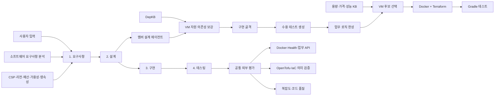
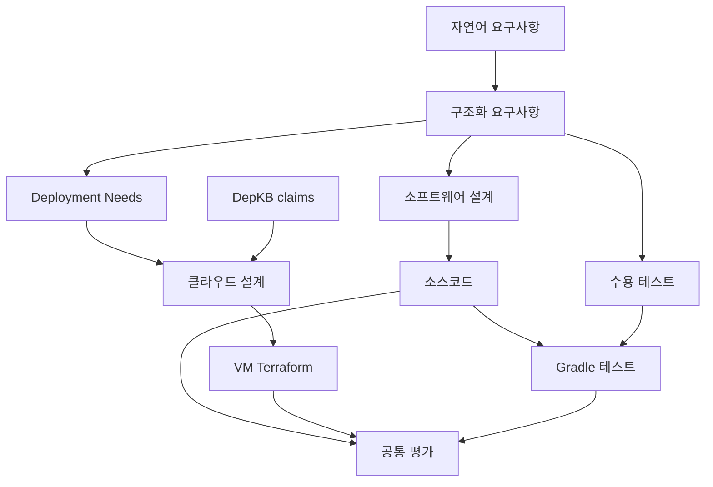
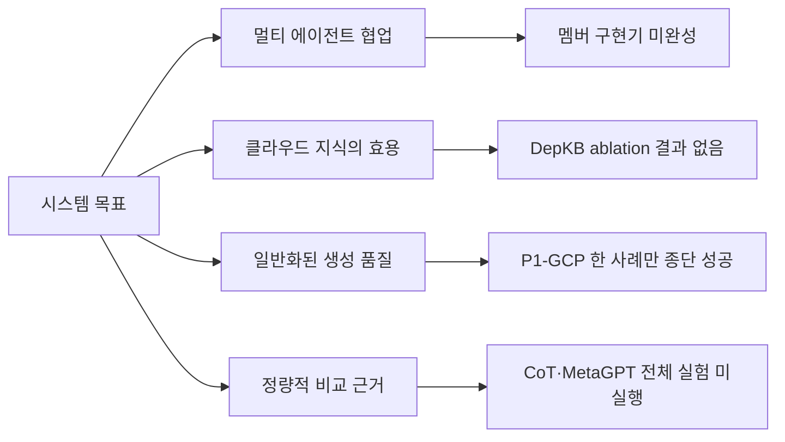

# EasyDep 현재 구조와 부족한 점

> 기준일: 2026-08-07  
> 시스템 목표: **멀티 AI 에이전트를 활용한 클라우드 네이티브 애플리케이션 개발 지원**

## 한눈에 보기

| 영역 | 현재 상태 | 판정 | 핵심 부족 사항 |
|---|---|---:|---|
| 4단계 파이프라인 | 요구사항 → 설계 → 구현 → 테스팅 연결 | ✅ | 멤버 구현기가 미완성이라 비교실험은 임시 LLM scaffold 사용 |
| 요구사항 분석 | 소프트웨어 요구사항과 클라우드 제약 구조화 | ✅ | 용량 산정에 필요한 트래픽·최소 사양이 자주 미확정 |
| 설계 | 기존 설계 산출물 + VM 배포 설계 보강 | ✅ | 요구사항에서 IaC까지 이어지는 추적성 정량 평가 부족 |
| 구현 | 소스, 수용 테스트, Dockerfile, VM Terraform 생성 | ⚠️ | 정식 구현 provider 확정 필요 |
| 테스팅 | Gradle 테스트 및 테스트 0개 성공 방지 | ✅ | 운영 품질·보안 검사는 공통 평가기에 일부만 존재 |
| DepKB | AWS·Azure·GCP의 VM 자원 의존성 제공 | ⚠️ | 생성 IaC의 KB 준수 효과를 비교실험으로 입증해야 함 |
| VM 선택 | 용량 필터 후 가격·성능 후보 추천 구조 | ⚠️ | 요구 용량이 없으면 의도적으로 추천 보류 |
| 비교실험 | EasyDep·LLM CoT·MetaGPT 및 공통 평가기 준비 | ⚠️ | 전체 개발·홀드아웃 반복 실험 미실행 |
| 종단 검증 | P1-GCP 1회 실험 적격 판정 | ⚠️ | 다른 CSP·앱 유형에 대한 일반화 근거 부족 |

범례: ✅ 동작 검증, ⚠️ 구조는 있으나 근거 또는 범위 부족, ❌ 미구현

## 현재 시스템 구조

클라우드 네이티브 기능은 별도 5단계가 아니라 기존 네 단계의 하위 작업으로 들어간다.



### 단계별 provider

| 단계 | 하위 작업 | 현재 기본/실험 provider |
|---|---|---|
| 요구사항 | 자연어 분석 및 클라우드 제약 구조화 | 멤버 에이전트 |
| 설계 | 소프트웨어 설계 | 멤버 에이전트 |
| 설계 | VM 자원 의존성 보강 | 내장 DepKB adapter |
| 구현 | 애플리케이션 골격 | 기본: 멤버 / 현재 비교실험: 명시적 LLM |
| 구현 | 수정 불가능한 수용 테스트 | LLM |
| 구현 | 업무 로직 완성 | LLM |
| 구현 | VM 후보 선택 | 결정론적 선택기 |
| 구현 | Docker 및 VM Terraform | LLM |
| 테스팅 | 생성 애플리케이션 테스트 | 내장 Gradle adapter |

선택한 provider가 실패하면 다른 provider로 자동 전환하지 않는다. 실행 manifest에 실제
provider가 기록되므로 임시 LLM 구현과 멤버 구현 결과를 구분할 수 있다.

## 데이터와 산출물 흐름



실행 결과는 중복 없이 다음 구조에 저장된다.

```text
artifacts/runs/<run-id>/
├── manifest.json
├── 01-requirements/
├── 02-design/
├── 03-implementation/
└── 04-testing/
```

실행 상태는 추가 의존성이 없는 SQLite 저장소에 보존한다. 구현 단계는 동시에 하나만
실행하며 timeout 시 하위 프로세스 트리도 종료한다.

## 클라우드 범위

### 포함

- AWS, Azure, GCP
- Docker-on-VM 배포
- VM, 부트 디스크, NIC, 네트워크, 서브넷, 공인 IP, 방화벽
- 요구될 때만 영속 데이터 디스크와 로드밸런서
- HTTPS 진입점, health endpoint, 애플리케이션 포트
- VM 용량·가격·성능 후보 선택

### 제외

- Kubernetes 기반 배포
- VPN
- 서버리스 및 관리형 애플리케이션 플랫폼
- 모든 CSP 리소스를 포괄하는 범용 지식베이스

이 제한은 학부 졸업과제에서 검증 가능한 범위를 확보하기 위한 의도적 결정이다.

## 현재 검증된 것

P1-GCP 무상태 변환 API 사례에서 다음 결과를 확인했다.

| 항목 | 결과 |
|---|---:|
| 4단계 완료 | 통과 |
| Gradle 수용 테스트 | 통과 |
| Docker build 및 health | 통과 |
| 업무 API acceptance | 2/2 통과 |
| OpenTofu 검증 | 통과 |
| IaC 의미 검증 | 12/12 통과 |
| 불필요한 영속 데이터 디스크 | 없음 |
| 순환복잡도 | 평균 2.36, 최대 6, 10 초과 함수 0개 |
| 실험 적격성 | `experimentEligible=true` |

이 결과는 **종단 실행 가능성**은 보여주지만 시스템의 일반적 우수성을 입증하지는 않는다.

## 목표 대비 핵심 부족 사항



### 1. 정식 구현 경로

현재 비교실험은 멤버 구현기의 변환 오류를 피하기 위해 명시적 LLM scaffold를 사용한다.
따라서 멤버 구현기를 완성하거나 LLM scaffold를 정식 provider로 정의해야 한다.

### 2. 요구사항 추적성

RTM의 역할은 남아 있지만 다음 연결을 정량적으로 평가하지 않는다.

```text
요구사항 ID → 설계 결정 → 소스/IaC 요소 → 테스트 결과
```

최종 산출물 평가와 별도로, 클라우드 제약이 실제 자원으로 반영됐는지 추적하는 지표가
필요하다.

### 3. 용량 추정

VM 선택기는 최소 vCPU·메모리 같은 용량 하한이 없으면 추천을 보류한다. 이는 임의 추천을
막는 올바른 동작이지만, 사용자에게 어떤 추가 정보를 받을지 또는 소프트웨어 설계로부터
어떻게 추정할지 아직 완성되지 않았다.

### 4. DepKB 효과 입증

DepKB는 설계에 사용되지만 다음 비교 결과가 아직 없다.

- EasyDep full과 cloud-KB 미사용 버전의 자원 누락률
- 의존성 edge 정확도와 불필요 자원 수
- IaC 의미 검증 통과율
- CSP별 생성·삭제 순서 및 호환성 위반률

### 5. 앱과 CSP 일반화

현재 유효한 종단 성공은 P1-GCP 한 건이다. 다음 사례는 준비됐지만 전체 실행하지 않았다.

- P1 무상태 앱: AWS, Azure, GCP
- P2 영속 데이터 앱: AWS, Azure, GCP
- P3 고가용성 앱: AWS, Azure, GCP
- 도메인 홀드아웃: 원격진료, 물류, 파트너 리포팅

### 6. 비교실험 결과

EasyDep, LLM CoT, MetaGPT 실행기와 공통 평가기는 준비됐다. 그러나 반복 실험 결과와
통계가 없으므로 현재는 효용성 주장을 할 수 없다.

핵심 지표는 다음으로 제한한다.

- 종단 성공률과 기능 요구사항 만족률
- IaC 의미 검증 및 의존성 정확도
- 불필요·금지 자원 생성률
- Docker·health·업무 API 통과율
- 순환복잡도 분포
- 실행 시간, LLM 호출 수, 실패율

### 7. 문서 일관성

루트 `README.md`와 문서 색인은 현재 4단계 구조를 기준으로 정리했다. 초기 MySQL 인수인계,
minikube·AKS 요구사항 배포, Kubernetes manifest 생성 및 완료된 병합 계획은 `docs/archive/`로
이동했다. 활성 문서는 이 문서의 상태 요약을 중복하지 않고 연결해서 사용한다.

## 다음 진행 순서

| 우선순위 | 작업 | 완료 기준 |
|---:|---|---|
| 1 | P1의 AWS·Azure 종단 gate | 3사 모두 공통 평가 완료 |
| 2 | P2 영속성 사례 gate | 필요한 데이터 디스크만 생성·검증 |
| 3 | P3 고가용성 사례 gate | VM 수·LB·가용성 조건 검증 |
| 4 | full vs no-cloud-KB | DepKB 효과 지표 산출 |
| 5 | CoT·MetaGPT 비교 | 동일 사례·모델·평가기 결과 확보 |
| 6 | 홀드아웃 실행 | 개발 사례에 맞춘 개선의 과적합 점검 |
| 7 | 문서 정리 | 완료 — 루트 README 최신화와 이력 문서 분리 |

본실험 전 최소 조건은 P1·P2·P3에서 각기 다른 클라우드 특성이 실제 구현과 평가까지
이어지는지 확인하는 것이다. 이후에만 전체 반복 실험을 실행한다.

## 관련 문서

- `app/core/orchestration/README.md`: 4단계 실행과 provider 계약
- `app/core/cloudkb/document/research.md`: 연구 목표와 범위
- `app/core/cloudkb/document/dependency-analysis.md`: 의존성 분석 정의
- `app/core/cloudkb/document/vm-scope.md`: VM 범위
- `app/core/cloudkb/document/vm-resource-selection.md`: VM 선택 원칙
- `evaluation/experiment-contract.md`: 비교실험 계약
- `evaluation/pilot-results.md`: 종단 파일럿 기록
