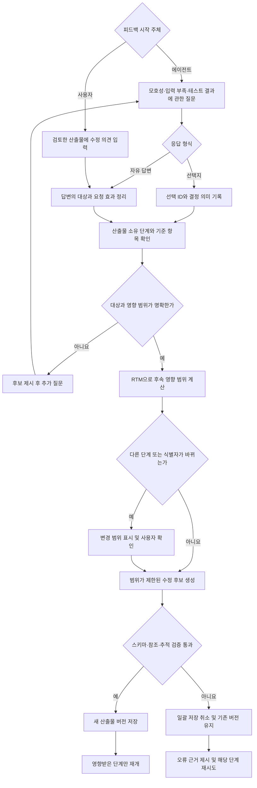

# 최종보고서 추가 원고: 사용자 피드백 기반 산출물 수정

> 편집 메모: 이 문서는 기존 최종보고서의 DOCX 파일을 수정하지 않고, 보고서에 옮겨 넣을 수 있도록 작성한 추가 원고이다. 방법론 부분은 「멀티 AI 에이전트 기반 클라우드 네이티브 애플리케이션 개발 지원 방법」 장의 「기술 개요」 다음에, 사례 부분은 「사례 애플리케이션 생성 및 AWS 배포 사례」 장의 「시스템 입력」 다음에 배치하는 구성을 권장한다. 그림과 표 번호는 원본 보고서에 삽입할 때 다시 부여한다.

## 1. 방법론 장 추가 원고

### 사용자 피드백 기반 산출물 수정 및 단계 재개

제안하는 시스템은 요구사항 분석, 시스템 설계, 시스템 구현과 테스팅을 한 번에 끝까지 실행하지 않는다. 각 에이전트가 검토 가능한 산출물을 생성하면 작업을 일시 중단하고, 사용자가 결과를 확인한 뒤 다음 단계로 진행하거나 수정 의견을 전달하도록 한다. 현재까지 확정된 요구사항과 산출물만으로 다음 단계의 입력을 하나로 결정할 수 없는 경우도 있다. 가능한 선택에 따라 기능 동작, 외부 인터페이스 또는 배포 구성이 달라지면 에이전트는 임의로 하나를 선택하지 않고 선택지와 자유 답변 입력을 제공한다. 이 구조에서 피드백은 단순한 대화 기록이 아니라, 수정 대상과 영향 범위가 지정된 새로운 작업 명령으로 처리된다.

본 보고서에서는 피드백을 시작한 주체에 따라 두 가지 방식으로 구분한다. 첫 번째는 **에이전트 요청형 피드백**이다. 에이전트가 다음 산출물을 결정할 입력이 부족하거나, 요구사항을 여러 동작으로 해석할 수 있거나, 테스트 실패의 처리 방법을 사용자가 결정해야 한다고 판단하면 작업을 중단하고 질문한다. 예를 들어 최소 컴퓨팅 용량을 입력하도록 요청하거나, 강좌 검색 조건에 관한 선택지를 제시하는 경우가 이에 해당한다. 두 번째는 **사용자 주도형 피드백**이다. 사용자가 단계별 산출물을 검토한 뒤 원하는 구조와 다르다고 판단하여 먼저 수정 의견을 입력한다. UC10을 두 유스케이스로 나누거나 클래스 연산 이름을 바꾸도록 요청한 사례가 이 방식에 해당한다.

이 문서에서 **사용자 의사결정 사항**은 현재 요구사항과 승인된 산출물에 둘 이상의 해석 또는 설정 후보가 남아 있으며, 어느 후보를 고르는지에 따라 기능 동작, API와 같은 외부 인터페이스 또는 클라우드 배포 구성이 달라지는 항목을 뜻한다. 선택지와 자유 형식 입력은 별도의 피드백 유형이 아니라 사용자가 결정을 전달하는 형식이다. 선택지는 에이전트가 구분한 후보 중 하나를 고를 때 사용하고, 자유 형식 입력은 사용자가 수정 대상과 원하는 결과를 직접 설명할 때 사용한다.

모델 응답의 스키마 오류, 미선언 타입과 실행 환경 오류는 사용자 의사결정 사항이 아니라 기술 실패로 구분한다. 기술 실패는 요구사항이나 배포 구성에 관한 사용자의 선택만으로 해결할 수 없으므로, 시스템이 오류 근거와 재시도 방법을 제시한다.

사용자 입력은 다음 과정을 거쳐 반영된다.

1. 시스템은 현재 산출물과 실행 상태를 `AWAITING_INPUT`으로 보존하고, 사용자가 선택할 수 있는 다음 행동을 공개한다.
2. 선택지 응답은 미리 정의된 의미로 변환하고, 자유 형식 의견은 수정 대상, 변경 종류와 요청 효과로 정리한다.
3. 산출물의 식별자와 요구사항 추적표(Requirements Traceability Matrix, RTM)를 이용하여 의미를 결정하는 기준 항목과 함께 수정해야 하는 후속 항목을 찾는다.
4. 대상이 여러 가지로 해석되면 수정하지 않고 정확한 항목을 다시 질문한다. 다른 개발 단계의 산출물이나 식별자가 함께 바뀌는 경우에는 영향 범위를 먼저 표시하고 별도의 적용 확인을 받는다.
5. 확인된 범위만 생성기에 전달하여 수정 후보를 만든다. 선택되지 않은 같은 단계의 산출물은 기존 값을 유지한다.
6. 수정 후보에 대해 스키마, 타입 참조, 다이어그램 호출 관계와 API 계약을 검사한다. 검증을 통과하면 새 버전으로 저장하고, 통과하지 못하면 일괄 변경을 저장하지 않는다.
7. 상위 산출물이 바뀌면 현재 추적 정보를 다시 계산하고, 영향을 받은 다음 단계만 새로운 명령으로 실행한다. 실패한 경우에도 완료된 이전 단계 전체를 처음부터 반복하지 않고 해당 체크포인트에서 재개한다.

다음 흐름은 이러한 피드백 처리 과정을 나타낸다.



그림 설명: 에이전트의 질문과 사용자의 직접 수정 요청은 서로 다른 지점에서 시작하지만, 답변 이후에는 같은 대상 확인·영향 분석·검증 과정을 거친다. 모호한 의견은 바로 실행하지 않으며, 검증에 실패한 후보는 현재 산출물을 덮어쓰지 않는다.

이 방식은 개발 단계별 산출물의 소유권을 유지한다. 예를 들어 구현 에이전트가 유스케이스의 의미 공백을 발견하더라도 구현 코드에서 임의의 정책을 추가하지 않는다. 해당 유스케이스를 소유한 요구사항 분석 단계로 질문을 전달하고, 사용자가 의미를 결정한 뒤 별도의 요구사항 수정 명령을 실행한다. 이후 현재 버전의 추적 관계를 기준으로 설계 변경 범위를 다시 계산한다. 같은 원칙에 따라 테스팅 에이전트가 발견한 소스 코드 결함은 구현 단계에 전달되며, 테스팅 에이전트가 직접 소스 파일을 수정하지 않는다.

산출물은 기존 내용을 덮어쓰지 않고 버전 단위로 저장한다. 각 수정 계획은 기준 산출물 버전과 추적 정보의 해시를 포함하므로, 사용자가 검토하는 동안 다른 변경으로 기준 버전이 달라진 경우 오래된 피드백을 그대로 적용하지 않는다. 또한 변경 후보 전체가 검증을 통과한 경우에만 함께 저장한다. 따라서 클래스 연산만 바뀌고 연결된 시퀀스 호출은 이전 이름을 유지하는 것과 같은 부분 저장을 방지할 수 있다.

### 피드백을 시작하는 두 가지 방식

| 구분 | 시작 조건 | 입력 방법 | 사례 |
|---|---|---|---|
| 에이전트 요청형 | 확정된 요구사항과 산출물만으로 기능 동작·외부 인터페이스·배포 구성을 하나로 결정할 수 없음 | 선택지 또는 자유 답변을 제시하고 사용자 응답까지 작업을 중단 | 최소 VM 용량 확인, UC1 검색 조건 선택, 테스트 수리 여부 확인 |
| 사용자 주도형 | 사용자가 검토한 산출물이 원하는 결과와 다름 | 수정할 대상, 원하는 변경과 유지할 범위를 사용자가 직접 입력 | UC10 분리, UC3 연산 이름 수정 |

두 방식은 피드백이 시작되는 경로만 다르며, 답변 이후에는 같은 처리 과정을 사용한다. 시스템은 입력을 구조화된 수정 의미로 정리하고, 대상 산출물의 소유 단계와 후속 영향 범위를 확인한다. 이후 사용자 확인과 검증을 통과한 결과만 새 버전으로 저장한다.

## 2. 사례 장 추가 원고

### 수강신청 애플리케이션의 단계별 피드백 적용

피드백 동작은 수강신청 애플리케이션의 자연어 요구사항 16개를 입력하여 Workspace API로 실행한 사례에서 확인하였다. 입력은 학생·교수·학사 관리자 역할, 개설 강좌 검색, 수강신청·교환·취소, 시간표, 대기열, 학기와 개설 강좌 관리, 권한 검사, 데이터 영속성과 동시성 조건을 포함한다. 주 실행에서는 요구사항과 설계 산출물의 수정, 배포 사양 선택과 구현 중 상위 명세 확인까지 하나의 앱에서 연속으로 수행하였다. 테스팅 피드백은 같은 16개 요구사항으로 수행된 별도 수강신청 앱의 저장된 실행 결과를 사용하였다. 이는 주 실행이 구현 단계에서 발견한 설계 전파 오류로 테스트 단계에 도달하지 못했기 때문이다.

#### 요구사항 입력 단계: 최소 컴퓨팅 용량의 선택 유보(에이전트 요청형)

시스템은 16개 요구사항을 14개의 기능 요구사항과 2개의 비기능 요구사항으로 정제한 뒤, 워크로드의 최소 vCPU 또는 최소 메모리를 알고 있는지 질문하였다. 용량 하한이 있어야 실제 VM 사양을 고를 수 있으며, 이 값이 없을 때 가장 작거나 가장 저렴한 인스턴스가 충분하다고 가정하지 않는다는 이유도 함께 제시하였다. 사용자는 이 시점에서 `Send answer` 또는 `Skip suggestion and continue`를 선택할 수 있었다.

사례 실행에서는 요구사항 분석 단계에서 용량을 임의로 정하지 않기 위해 건너뛰기를 선택하였다. 그 결과 요구사항과 유스케이스 분석은 계속 진행됐지만 VM 제품은 확정되지 않았다. 이후 배포 설계에서 실제 VM을 골라야 하는 시점에 다시 최소 용량을 입력하도록 하였다. 이는 선택 시점을 늦추는 것이 입력을 무시하는 것이 아니라, 해당 값이 필요한 단계까지 결정을 보류하는 동작임을 보여 준다.

#### 요구사항 분석 단계: 교수 유스케이스 분리(사용자 주도형)

최초 요구사항 분석 결과에서는 12개의 사용자 목표 유스케이스가 생성되었다. 이 가운데 UC10 `Review assigned course offerings and rosters`는 교수가 담당 개설 강좌 목록을 확인하는 목표와 특정 강좌의 수강생 명단을 확인하는 목표를 하나로 묶고 있었다. 사용자는 다음과 같이 UC10만 수정하고 다른 유스케이스는 유지하도록 피드백을 제공하였다.

> UC10은 교수의 ‘담당 강좌 목록 조회’와 ‘특정 강좌의 수강생 명단 조회’를 하나로 묶고 있습니다. 이 두 사용자 목표를 서로 다른 유스케이스로 분리해 주세요. UC10 이외의 유스케이스는 변경하지 마세요.

시스템은 수정 대상을 `use_case:UC10`으로 확정하고 국소 수정 계획을 만들었다. 적용 결과 UC10은 `Review assigned course offerings`로 변경되었고, `View student roster`가 UC13으로 추가되었다. 두 유스케이스는 모두 교수 액터와 원래 요구사항 RR11을 유지하였다. 나머지 11개 유스케이스의 구조화된 내용은 수정 전과 동일하게 보존되었다.

| 구분 | 수정 전 | 수정 후 |
|---|---|---|
| 담당 강좌 조회 | UC10에 수강생 명단 조회와 함께 포함 | UC10 `Review assigned course offerings` |
| 수강생 명단 조회 | 별도 사용자 목표 없음 | UC13 `View student roster` 추가 |
| 유스케이스 수 | 12개 | 13개 |
| 요구사항 연결 | UC10 → RR11 | UC10 → RR11, UC13 → RR11 |
| 비대상 유스케이스 | 11개 | 내용 변경 없음 |

이 사례는 사용자 의견을 받았을 때 전체 유스케이스를 다시 작성하는 대신, 지정된 사용자 목표를 분리하고 기존 요구사항 연결을 유지하는 과정을 보여 준다. 수정 전 산출물도 삭제되지 않았으며, 이후 명세 작성과 유스케이스 다이어그램 생성은 13개 유스케이스를 기준으로 계속되었다.

#### 시스템 설계 단계: 원자적 수강 교환 연산의 이름 수정(사용자 주도형)

수강 교환 유스케이스 UC3의 최초 시퀀스에서는 `RegistrationControl`의 `performSwap(currentRegistrationId:String, newOfferingId:String)` 연산을 호출하였다. 동작 자체는 교환을 나타냈지만, 연산 이름만으로는 기존 수강 내역 제거와 새 수강 내역 생성이 하나의 원자적 처리라는 요구사항 RR4를 분명하게 확인하기 어려웠다. 사용자는 이 연산을 `swapRegistrationAtomically`로 바꾸고, 클래스 연산과 UC3 시퀀스 호출에 같은 이름을 사용하도록 요청하였다.

첫 피드백만으로는 `RegistrationControl` 클래스, 경계 연산과 여러 제어 연산 중 어느 항목이 수정 권한을 가지는지 하나로 정할 수 없었다. 시스템은 가능한 연산 후보를 제시하고 정확한 기준 항목을 다시 질문하였다. 사용자는 `RegistrationControl::performSwap(currentRegistrationId:String,newOfferingId:String)`을 선택하고 매개변수, 반환형과 동작은 유지하도록 답하였다. 시스템은 이 변경이 연산 식별자와 연결된 UC3 시퀀스에 영향을 준다고 표시한 뒤 `Apply change`와 `Dismiss change`를 제공하였다.

적용 확인 후 클래스 다이어그램과 시퀀스 다이어그램이 함께 새 버전으로 저장되었다.

```text
수정 전 클래스 연산
RegistrationControl::performSwap(currentRegistrationId:String, newOfferingId:String) : SwapResult

수정 후 클래스 연산
RegistrationControl::swapRegistrationAtomically(currentRegistrationId:String, newOfferingId:String) : SwapResult
```

```text
수정 전 UC3 호출
StudentBoundary -> RegistrationControl : performSwap(currentRegistrationId, newOfferingId)

수정 후 UC3 호출
StudentBoundary -> RegistrationControl : swapRegistrationAtomically(currentRegistrationId, newOfferingId)
```

변경 전후에 연산의 내부 안정 식별자, 두 매개변수와 `SwapResult` 반환형은 유지되었다. `RegistrationControl`을 제외한 16개 클래스, 데이터 타입과 클래스 관계는 바뀌지 않았으며, UC3을 제외한 12개 시퀀스 다이어그램도 동일하게 보존되었다. 클래스 다이어그램은 GENERATED 버전 1에서 FEEDBACK_REVISED 버전 2로, 시퀀스 다이어그램도 GENERATED 버전 1에서 FEEDBACK_REVISED 버전 2로 갱신되었고 두 버전 모두 구문 검증을 통과하였다.

이 결과는 자연어 피드백을 단순 문자열 치환으로 처리하지 않고, 연산의 동일성을 유지하면서 이름과 추적된 호출을 함께 바꾸는 과정을 보여 준다. 또한 수정 권한이 모호할 때에는 시스템이 임의의 항목을 선택하지 않고, 사용자가 정확한 연산을 지정하도록 질문한다.

#### 배포 설계 단계: 용량과 비용을 비교한 VM 선택(에이전트 요청형)

배포 다이어그램은 AWS 서울 리전(`ap-northeast-2`)을 대상으로 생성되었다. 그러나 요구사항 단계에서 최소 용량 입력을 보류했으므로, 최초 VM 사양 조회 결과는 후보 0개와 `needsInput` 상태였다. 시스템은 VM 제품을 선택하려면 최소 vCPU와 메모리가 필요하다고 설명하였다.

사례 실행에서는 소규모 시범 운영을 위한 입력값으로 2 vCPU와 4 GiB 메모리를 지정하였다. 그 결과 조건을 만족하는 후보 5개가 제시되었으며, 목록 앞부분에는 `t3a.medium` 월 34.164달러, `t3.medium` 월 37.960달러와 `t2.medium` 월 42.048달러가 포함되었다. 비용은 월 730시간을 사용한 온디맨드 컴퓨팅 목록 가격으로 계산되었다. 사용자는 `t3a.medium` 1대를 선택하였고, 배포 다이어그램의 sizing 상태는 `completed`로 변경되었다.

이 비용은 전체 서비스 비용이 아니다. 시스템은 저장소, 데이터베이스, 네트워크, 로드 밸런서, 세금, 지원 비용과 할인 금액을 제외한 컴퓨팅 가격이라는 범위를 함께 표시하였다. 또한 `t3a.medium`은 버스트형 인스턴스이므로 CPU 크레딧이 소진되면 기준 성능으로 낮아질 수 있다는 경고와 무료 사용 대상이 아니라는 정보도 제공하였다. 따라서 사용자는 단순히 가장 낮은 숫자만 고르는 것이 아니라, 용량 하한, 가격 범위와 성능 특성을 함께 확인한 뒤 선택할 수 있다.

#### 구현 단계: 검색 조건의 의미를 사용자에게 다시 확인(에이전트 요청형)

설계 완료 후 구현을 시작하자 백엔드 구현 하위 작업은 UC1의 `matching course offerings`를 어떤 기준으로 검색해야 하는지 결정할 수 없다고 판단하고 파일을 수정하기 전에 중단하였다. 당시 API와 제어 연산에는 검색 매개변수가 없었고, 유스케이스에도 학기, 교과목 코드 또는 교수와 같은 필터 기준이 정의되지 않았다. 또한 개설 강좌가 `published` 상태인지 판정할 속성도 클래스에 명시되어 있지 않았다. 이 상태에서 구현을 계속하면 모든 공개 강좌를 반환하는 동작과 입력 조건으로 필터링하는 동작 중 하나를 구현 에이전트가 임의로 선택하게 된다.

시스템은 다음 세 선택지와 자유 답변 입력을 제공하였다.

| 선택지 | 의미 |
|---|---|
| Return all published offerings | 호출자가 조건을 전달하지 않으며 모든 공개 강좌를 반환 |
| Filter by term and course code | 학기와 교과목 코드를 검색 조건으로 전달 |
| Filter by academic term | 학기만 검색 조건으로 전달 |
| Provide another answer | 사용자가 다른 검색 규칙을 직접 작성 |

사례 실행에서는 `Filter by term and course code`를 선택하였다. 시스템은 이를 UC1의 의미를 바꾸는 결정으로 정규화하고, 요구사항 분석 단계가 소유한 `use_case_spec:UC1`로 전달하였다. 또한 영향을 받는 항목으로 `searchCourseOfferings` API, `UniversityUserBoundary`와 `CourseSearchControl`의 검색 연산, UC1의 호출과 시퀀스 다이어그램을 제시한 뒤 적용 확인을 요청하였다.

적용 후 UC1 명세는 버전 3에서 버전 4로 바뀌었다. 수정 전 트리거는 “사용자가 공개 강좌 검색을 시작한다”였으나, 수정 후에는 “사용자가 학기와 교과목 코드를 지정하여 공개 강좌 검색을 시작한다”로 구체화되었다. 주 시나리오 1단계도 주어진 학기와 교과목 코드로 검색을 요청하는 내용으로 변경되었다. 다른 12개 유스케이스 명세는 유지되었다.

다만 이 실행은 구현 완료 사례가 아니다. 선택지 설명에서는 학기와 교과목 코드를 선택 조건으로 제시했지만 생성된 UC1 문장은 두 값을 지정하는 형태로 좁혀졌다. 또한 후속 설계 전파 과정에서 수신 연산 서명 불일치와 미선언 반환 타입이 차례로 발견되었다. 시스템은 각 시도를 `Revision failed; no batch changes were saved`로 종료하여 클래스와 API의 기존 버전을 보존하였다. 최종 상태에서 UC1 명세 버전 4는 저장되었지만, 클래스 다이어그램은 앞선 UC3 수정 결과인 버전 2, API 명세는 버전 1을 유지하였다.

이 사례는 두 가지를 보여 준다. 첫째, 구현 에이전트가 요구사항의 의미를 추측하지 않고 사용자에게 선택 가능한 동작을 제시할 수 있다. 둘째, 사용자가 선택한 의미가 모든 후속 산출물에 정상 반영되었다고 간주해서는 안 되며, 수정된 문장의 세부 의미와 설계 전파 결과를 다시 검토해야 한다. 검증 실패 시 기존 설계를 보존하는 동작은 부분적으로 잘못된 산출물이 구현 입력으로 사용되는 것을 막지만, 반복되는 생성 오류를 자동으로 해소하지는 못한다.

#### 테스팅 단계: 동적 테스트 실패와 수리 위임(에이전트 요청형)

테스팅 피드백은 동일한 16개 요구사항으로 생성된 별도 수강신청 앱의 Workspace 저장 결과에서 확인하였다. 동적 기능 테스트의 UC1 시나리오는 먼저 `GET /offerings`를 호출하여 HTTP 200을 받았지만, 다음 단계에서 생성된 개설 강좌 식별자 `CS101-2023-Fall`로 `GET /offerings/{offeringId}`를 호출했을 때 HTTP 404가 반환되었다. 테스트 에이전트는 이를 단순 서버 오류가 아니라, 성공 경로에 필요한 사전 데이터가 테스트 프로필에 없다는 `TEST_PROFILE_DATA_UNAVAILABLE` 결함으로 기록하였다. 결함 소유 단계도 애플리케이션 구현이 아니라 테스팅으로 분류하였다.

사용자는 Workspace의 `delegate_repair` 명령을 통해 자동 수리를 요청하였다. 시스템은 누적된 실패 근거를 사용하여 세 차례 수리 후보를 검사했지만 수락된 변경은 0건이었다. 중간 시도에서 `GET /offerings`의 HTTP 500 문제는 사라졌으나, 최종적으로 상세 조회의 성공 경로에 필요한 유효한 선행 데이터가 마련되지 않아 동적 기능 게이트는 `FAIL`로 남았다. 이 실패가 해결되지 않았으므로 정적 검사, 배포 패키지 검사와 IaC 검사는 해당 실행에서 뒤로 미뤄졌다.

이 결과는 테스트 피드백 루프가 실패 메시지를 구현 에이전트에 전달하는 것만으로 끝나지 않고, 동일한 테스트 근거로 수정 전후를 다시 판정한다는 점을 보여 준다. 반면 세 번의 시도에서 개선이 확인되지 않은 후보를 적용하지 않았다는 점도 중요하다. 따라서 보고서에서는 이 사례를 “자동 수리 성공”으로 표현하지 않고, 테스트 실패를 분류하고 수리를 위임했으나 수렴하지 못한 사례로 해석한다.

### 단계별 적용 결과 요약

| 개발 단계 | 피드백 또는 사용자 결정 | 실제 결과 | 판정 |
|---|---|---|---|
| 요구사항 입력 | 최소 용량 입력을 뒤 단계로 유보 | VM 제품을 가정하지 않고 요구사항 분석만 계속 | 정상 반영 |
| 요구사항 분석 | UC10의 담당 강좌 조회와 수강생 명단 조회 분리 | UC10 수정, UC13 추가, 나머지 11개 유지 | 정상 반영 |
| 시스템 설계 | `performSwap`을 `swapRegistrationAtomically`로 변경 | 클래스 연산과 UC3 호출을 함께 수정하고 나머지 설계 유지 | 정상 반영 |
| 배포 설계 | 2 vCPU·4 GiB, `t3a.medium` 1대 선택 | 예상 컴퓨팅 비용과 경고를 포함한 sizing 완료 | 정상 반영 |
| 시스템 구현 | 검색 조건을 학기와 교과목 코드로 선택 | UC1 명세는 수정됐으나 후속 설계 전파가 검증 실패 | 부분 반영 |
| 테스팅 | 동적 테스트 실패의 자동 수리 위임 | 세 차례 시도, 수락 0건, 동적 기능 게이트 FAIL 유지 | 미수렴 |

본 사례에서 사용자 피드백은 산출물 검토 이후의 부가 기능이 아니라 개발 단계 사이의 의사결정 수단으로 사용되었다. 시스템은 입력이 부족할 때 선택을 요청하고, 사용자가 원하는 구조와 다른 산출물은 대상 범위를 제한하여 새 버전으로 수정하였다. 또한 상위 명세의 의미가 불명확한 경우 구현을 중단하였으며, 수정 후보가 참조·타입 검증을 통과하지 못하면 기존 산출물을 유지하였다. 다만 구현 단계에서 시작된 상위 명세 변경이 후속 설계까지 수렴하지 못했고, 별도 테스트 실행의 자동 수리도 완료되지 않았다. 따라서 현재 결과는 피드백의 대상 지정, 영향 범위 확인과 안전한 실패 처리는 확인했으나, 모든 종류의 피드백이 자동으로 최종 구현과 테스트 성공까지 이어진다고 일반화할 수는 없다.

## 3. 그림 및 표 구성 제안

보고서에는 다음 자료를 함께 배치할 수 있다.

1. **사용자 피드백 처리 흐름**: 본 문서의 Mermaid 흐름을 보고서의 기존 도식 형식으로 다시 그린다.
2. **유스케이스 수정 전후**: UC10 하나에 두 목표가 있던 상태와 UC10·UC13으로 나뉜 상태를 나란히 배치한다.
3. **UC3 설계 수정 전후**: 클래스 연산 이름과 시퀀스 호출 이름이 함께 바뀐 부분을 확대하여 표시한다.
4. **구현 단계 선택 화면**: 검색 조건에 관한 세 선택지와 자유 답변 항목을 캡처하고, 그 아래에 UC1 명세 버전 3·4의 문장 차이를 제시한다.
5. **검증 실패 시 버전 보존**: 수정 후보의 참조 또는 타입 검증이 실패하면 새 클래스·API 버전이 생성되지 않는 흐름을 간단한 도식으로 표시한다.

권장 표 제목은 `표 ○. 개발 단계별 사용자 피드백과 산출물 변경 결과`이며, 위의 「단계별 적용 결과 요약」을 사용할 수 있다. 권장 그림 제목은 `그림 ○. 사용자 피드백의 정규화·영향 분석·검증 흐름`, `그림 ○. 교수 유스케이스 분리 전후`, `그림 ○. UC3 원자적 교환 연산의 클래스·시퀀스 동시 수정`이다.

## 4. 실행 근거

### 주 실행: 요구사항·설계·배포·구현 피드백

- Workspace 앱 ID: `2b09c0e6-a14a-4f97-9066-77947e2b5ae9`
- 입력: `evaluation/baselines/course-registration-cases/e1-course-registration-aws.json`의 요구사항 16개와 AWS 서울 리전·월 500 USD 제약
- 앱 생성 명령: `7e0a97c5-399e-468e-9732-23e82c3b41ef`
- UC10 분리 피드백 명령: `24d71022-2599-4760-b0d7-936fba953a4b`
- UC3 설계 피드백 명령: `b794ef0f-212f-4696-ab51-157539f1f19d`
- UC3 기준 연산 선택 명령: `87f0d170-cc2a-4ba0-9bdd-c04ec9678f02`
- UC3 적용 확인 명령: `174612d5-216e-470d-89d3-f6ab2c7d44ce`
- 구현 시작 명령: `026e1e8f-bff6-4616-b5c3-a04ac6702033`
- 구현 중 검색 조건 선택 명령: `8da14a2d-6380-4858-a159-d734eadbbad6`
- UC1 요구사항 변경 확인 명령: `3c8d5ccc-ebd3-4c2e-80af-feeae42ae159`

재현에 사용한 주요 읽기 API는 다음과 같다.

```text
GET /api/workspace/apps/{app_id}
GET /api/apps/{app_id}/stages/usecase_spec/versions
GET /api/apps/{app_id}/stages/usecase_spec/versions/{version_no}
GET /api/apps/{app_id}/stages/class_diagram/versions
GET /api/apps/{app_id}/stages/sequence_diagram/versions
GET /api/apps/{app_id}/stages/api_spec/versions
GET /api/apps/{app_id}/stages/deployment_diagram/versions
GET /api/workspace/apps/{app_id}/deployment-sizing
```

### 별도 실행: 테스팅 피드백

- Workspace 앱 ID: `6f9fd91d-0ad5-459c-b451-165aafe496fb`
- 입력: 주 실행과 동일한 수강신청 요구사항 16개
- 테스트 결과 조회: `GET /api/workspace/apps/{app_id}/testing-result`
- 자동 수리 위임 명령: `9fe0cc3e-64d6-4a61-998e-0493505d8f94`
- 최종 동적 테스트 결함 코드: `TEST_PROFILE_DATA_UNAVAILABLE`
- 테스트 결과: `FAIL` 1개, 수리 시도 3회, 수락된 변경 0건

이 실행 ID와 API 응답은 사례의 재현 근거이며, 본문에서는 독자의 흐름을 방해하지 않도록 앱 ID와 명령 ID를 생략하고 결과만 설명하는 것이 적절하다.
