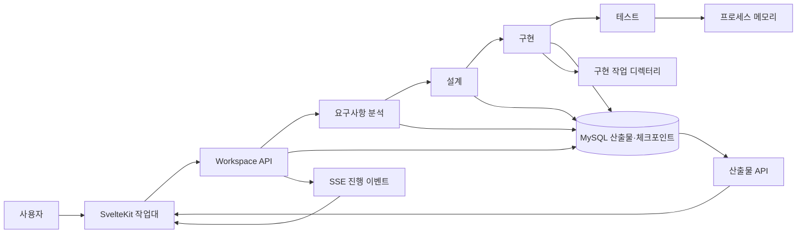
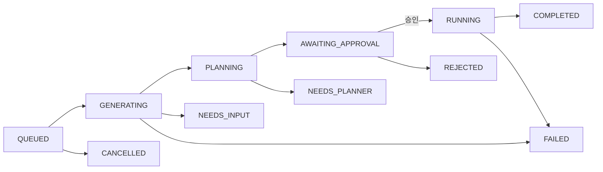

# EasyDep 전체 실행 흐름과 데이터 계약

> 기준일: 2026-08-29  
> 대상: `dev` 브랜치의 현재 코드  
> 목적: 기능을 줄이거나 고치기 전에, 사용자의 입력이 어떤 API와 LLM을 거쳐 어떤 산출물이 되는지 한 문서에서 확인한다.

## 이 문서를 읽는 방법

이 문서는 바라는 구조를 설명하는 설계안이 아니라 **현재 코드가 실제로 하는 일**을 설명한다.
프론트엔드가 호출하는 경로를 기본 흐름으로 삼고, 개발용 직접 API는 별도로 표시한다.

타입 표기에서 `?`는 값이 없을 수 있다는 뜻이고, `list[T]`는 `T` 여러 개,
`dict[str, T]`는 문자열 키와 `T` 값으로 이루어진 JSON 객체를 뜻한다. Python의 Pydantic
모델과 TypeScript 타입이 같은 JSON을 가리키면 화면에 보이는 이름을 우선 사용한다.

이 문서가 설명하는 것은 현재 데이터 계약이다. 아직 프로덕션 서비스가 아니므로 과거 버전의
체크포인트를 모두 읽게 만드는 호환 코드는 목표로 삼지 않는다. 타입을 바꿀 때에는 현재 MySQL
데이터를 지우거나 다시 만드는 방법을 함께 적으면 된다.

자주 나오는 용어는 다음 뜻으로 사용한다.

| 용어 | 이 문서에서의 뜻 |
|---|---|
| CSP | AWS, Azure, GCP 같은 클라우드 서비스 제공자 |
| BCE | Boundary(사용자·외부와 만나는 부분), Control(유스케이스 진행), Entity(업무 데이터)를 나눈 클래스 설계 방식 |
| 산출물 | 요구사항 JSON, 다이어그램, OpenAPI, 생성 source처럼 한 단계가 만든 결과 |
| 체크포인트 | 실행이 어디까지 진행됐는지와 중간 상태를 저장한 재개 지점 |
| digest | 내용에서 계산한 고정 길이 지문. 내용이 같은지 빠르게 비교하는 데 사용 |

## 1. 한눈에 보는 실제 흐름



사용자가 화면에서 앱을 만들면 다음 순서로 진행한다.

1. `POST /api/workspace/apps`가 앱 ID를 만들고 첫 요구사항 명령을 등록한다.
2. 백그라운드 작업이 요구사항 분석을 실행한다. 질문이나 검토가 필요하면 명령 상태가
   `AWAITING_INPUT`이 된다.
3. 사용자가 진행을 선택하면 `start_design` 명령이 설계 그래프를 시작한다.
4. 설계는 클래스 → 시퀀스 → API → ERD → 배포 다이어그램 순서로 실행된다. 각 설계
   단계가 끝날 때 검토 지점에서 멈춘다.
5. `start_implementation` 명령은 저장된 최신 설계를 읽어 구현 작업을 만든다. 외부 LLM으로
   코드를 보내기 전에는 전송 승인 요청이 화면에 나타난다.
6. 구현 작업이 끝나면 생성 파일을 MySQL의 버전이 고정된 파일 묶음으로 저장한다.
7. `start_testing` 명령은 그 구현 작업이 저장한 파일 버전을 고정하고, 같은 파일 묶음으로
   단위 테스트·정적 검사·동적 기능 검사를 실행한다.

`app/workspace/`는 새 분석기나 생성기가 아니다. 화면의 명령을 기존 요구사항·설계·구현·테스트
서비스 호출로 바꾸고, 결과를 화면이 이해하는 공통 상태로 정리하는 조정 계층이다.

## 2. 사용자 입력과 프론트엔드 계약

### 2.1 앱을 만들 때 받는 값

프론트엔드의 최초 입력은 다음 값이다.

```ts
type CreateAppInput = {
  message: string;                    // 만들려는 애플리케이션 설명, 1~30,000자
  provider?: "aws" | "azure" | "gcp";
  region?: string;                    // 최대 100자
  monthly_budget_amount?: number;     // 0보다 큰 값
  monthly_budget_currency?: string;   // 기본 USD, 영문 3자
  resource_constraints_text?: string; // 추가 제약, 최대 12,000자
};
```

클라우드 입력은 요구사항 원문에 합쳐 버리지 않는다. 선택한 값은 구조화된 초기 제약으로
요구사항 분석기에 전달하고, 이후 배포 대안을 고르면 `deployment_preferences`에도 저장한다.

### 2.2 작업대가 실제로 호출하는 API

| 메서드와 경로 | 화면에서 하는 일 | 주된 반환값 |
|---|---|---|
| `GET /api/workspace/apps` | 최근 앱 목록 | 앱 ID, 현재 단계, 최근 명령 |
| `POST /api/workspace/apps` | 앱 생성과 첫 요구사항 분석 시작 | `app_id`, `command_id` |
| `GET /api/workspace/cloud-options` | CSP와 리전 선택지 조회 | provider·region 목록 |
| `GET /api/workspace/apps/{app_id}` | 새로고침 후 작업대 전체 복원 | 단계, 명령, 이벤트, 산출물 상태 |
| `PUT /api/workspace/apps/{app_id}/deployment-preferences` | 배포 대안과 예산 저장 | 저장된 선택값 |
| `POST /api/workspace/apps/{app_id}/commands` | 메시지·진행·수리·승인·테스트 요청 | 새 `WorkspaceCommand` |
| `GET /api/workspace/apps/{app_id}/events?after={event_id}` | 진행 이벤트를 SSE로 받음 | `WorkspaceEvent` 연속 전송 |
| `GET /api/workspace/apps/{app_id}/commands/{command_id}/previews/class_diagram` | 클래스 생성 중 임시 그림 조회 | `LiveDiagramPreview` |
| `GET /api/apps/{app_id}` | 저장된 요구사항·설계 산출물 조회 | 산출물·검증·상태 |
| `GET /api/apps/{app_id}/stages/{stage}/versions` | 산출물 버전 목록 | 버전 번호와 생성 시각 |
| `GET /api/implementation/apps/{app_id}/artifacts/{type}` | 구현 파일 목록 | 경로와 SHA-256 |
| `GET /api/implementation/apps/{app_id}/artifacts/{type}/files/{path}` | 구현 파일 내용 조회 | UTF-8 내용과 SHA-256 |
| `GET /api/implementation/apps/{app_id}/download` | 구현 파일 ZIP 다운로드 | 파일 묶음과 manifest |

요구사항·설계·구현 변경·테스팅을 위한 별도 HTTP 주소는 제공하지 않는다. 구현 산출물 조회용
`/api/implementation` GET 주소만 남아 있으며, 실행 상태와 다음 행동은 Workspace API에서 본다.

### 2.3 화면 명령 타입

```ts
type Stage = "requirements" | "design" | "implementation" | "testing";

type CommandStatus =
  | "QUEUED"
  | "RUNNING"
  | "AWAITING_INPUT"
  | "COMPLETED"
  | "FAILED"
  | "INTERRUPTED";

type WorkspaceCommand = {
  command_id: string;
  app_id: string;
  action: string;
  stage: Stage;
  status: CommandStatus;
  payload: Record<string, unknown>;
  result?: Record<string, unknown>;
  error?: string;
  created_at?: string;
};
```

`POST .../commands`에서 허용하는 `action`은 다음과 같다.

```text
message, advance, delegate_repair,
confirm_change, dismiss_change,
start_design, retry_requirements, retry_design,
start_implementation, rerun_implementation,
approve_implementation, reject_implementation, cancel_implementation,
start_testing, apply_deployment_preferences
```

명령에는 필요에 따라 `text`, `context`, `action_id`, 구현·테스트 작업 ID,
`base_package`, `allow_assumptions`, `retry_failed`, `delegate_repair_approvals`,
`auto_approve_method_proposals`, `deployment_preferences`가 들어간다.

한 앱에서는 `QUEUED` 또는 `RUNNING` 명령을 동시에 두 개 실행하지 않는다.
`AWAITING_INPUT`은 실행 중인 명령으로 보지 않으므로 사용자가 답변이나 다음 행동을 보낼 수 있다.

### 2.4 진행 이벤트

```ts
type WorkspaceEvent = {
  event_id: number;
  app_id: string;
  command_id?: string;
  stage: Stage;
  kind: string;
  actor: string;
  text: string;
  metadata: Record<string, unknown>;
  created_at: string;
};
```

이벤트는 화면에 표시해도 되는 상태·진행률·검증 요약이다. 설계 LLM 호출의 측정 이벤트에는
현재 개발 설정상 실제 `responseContent`, `reasoningContent`, 토큰 수, 종료 이유와 스키마 오류도
들어갈 수 있다. 브라우저에 토큰 단위 스트리밍을 하는 것은 아니다.

SSE는 새 이벤트를 1초 간격으로 확인하고, 새 이벤트가 없으면 주기적으로 heartbeat를 보낸다.

## 3. 요구사항 단계

### 3.1 서비스 입력 타입

Workspace는 최초 실행과 후속 답변을 모두 `AnalyzeRequest`로 바꾸어 요구사항 서비스에 넘긴다.

```python
class AnalyzeRequest(BaseModel):
    requirements: list[str] | None
    cloud_constraints: InitialCloudConstraints | None
    deployment_preferences: DeploymentPreferences | None
    resource_constraints_text: str | None
    answer: str | None
    edit: FeedbackEdit | None
    resource_answers: dict[str, str] | None
    thread_id: str | None
    feedback_gates: bool | None
    app_id: str | None


class InitialCloudConstraints(BaseModel):
    provider: Literal["aws", "azure", "gcp"]
    region: str
    monthly_budget_amount: float | None
    monthly_budget_currency: str


class FeedbackEdit(BaseModel):
    stage: Literal["actors", "use_cases", "specs", "relationships"]
    scope: Literal["local", "broad"]
    target_ids: list[str]
    instruction: str
```

`InitialCloudConstraints` 객체를 보낼 때에는 provider와 region이 둘 다 있어야 한다. 앱 생성
HTTP 요청에서는 두 필드를 생략할 수 있지만 하나만 보내는 것은 거절한다. 리소스 질문의 답은
별도 객체로 한 번 더 감싸지 않고 `resource_answers={필드 이름: 사용자 답변}`으로 직접 보낸다.

최초 실행에서는 `thread_id`와 `app_id`에 같은 앱 ID를 넣고 `feedback_gates=True`로 실행한다.
따라서 서버 전체 기본값이 비대화형이어도 작업대 경로에서는 단계별 검토를 사용한다.

### 3.2 내부 실행 순서

요구사항 단계 순서는 `app/requirements/stage_registry.py`의 `PIPELINE` 한 곳에서 정한다.

| 순서 | 코드 단계 | 하는 일 | LLM 사용 |
|---:|---|---|---:|
| 1 | `expand_requirements` | 여러 뜻이 섞인 원문을 분석 가능한 요구사항 후보로 펼침 | 사용 |
| 2 | `intake` | 원문과 후보를 내부 상태에 등록 | 미사용 |
| 3 | `clarify` | 모호한 표현을 다듬고 필요한 질문을 만듦 | 사용 |
| 4 | `classify` | 기능 요구사항(FR)과 품질 요구사항(NFR) 분류 | BERT 중심 |
| 5 | `analyze_cloud_inputs` | 배포 필요와 클라우드 제약을 구조화 | 사용 |
| 6 | `build_resource_spec` | 구조화된 클라우드 입력을 리소스 계약으로 변환 | 미사용 |
| 7 | `identify_actors` | 액터 후보 생성 | 사용 |
| 8 | `identify_use_cases` | 유스케이스와 요구사항 연결 생성 | 사용 |
| 9 | `review_model` | 액터·유스케이스 의미 검사 | 설정에 따라 사용 |
| 10 | `check_coverage` | 요구사항 누락과 추적 연결 검사 | 미사용 |
| 11 | `generate_specs` | 유스케이스별 상세 시나리오 생성 | 사용, 유스케이스별 병렬 |
| 12 | `check_specs` | 명세 구조·내용 검사와 단계 내부 수리 | 검사 일부에 사용 |
| 13 | `identify_relationships` | include·extend·일반화 관계 생성 | 사용 |
| 14 | `check_relationships` | 관계 검사와 단계 내부 수리 | 검사 일부에 사용 |
| 15 | `render_diagram` | 유스케이스 모델을 PlantUML로 그림 | 미사용 |

표의 “LLM 사용”은 대표 경로를 뜻한다. 설정에 따라 의미 검사, 예시 선택, 리소스 분석의
보조 호출이 추가될 수 있다. HTTP 요청 하나와 LLM 호출 하나는 같은 단위가 아니다.

### 3.3 주요 LLM 출력 타입

요구사항 LLM은 자유 형식 문장을 다음 Pydantic 모델 중 하나로 반환한다.

| 목적 | 최상위 타입 | 중요한 내부 필드 |
|---|---|---|
| 요구사항 구체화 | `ClarifyOnlyResult` | `requirementDrafts: list[RefinedRequirementProposal]`, `constraint_links` |
| 배포 필요 분석 | `DeploymentNeedsResult` | `deploymentNeeds: dict[str, DeploymentNeed]` |
| 클라우드 제약 추출 | `CloudConstraintExtraction` | provider, region, budget, CPU, memory, traffic, scale, residency, evidence, ambiguous |
| 액터 생성 | `ActorResult` | `actors: list[Actor{name, description, parent_actor, sourceRefs}]` |
| 유스케이스 생성 | `UseCaseResult` | 이름, 주·보조 액터, 수준, 목표, 연결된 FR/NFR ID |
| 유스케이스 명세 | `UseCaseSpec` | 사전조건, trigger, main scenario, extensions, guarantees |
| 관계 생성 | `RelationshipModel` | include·extend 선택과 근거 |
| 의미 검사 | `Critique`, `RuleVerdict` | 규칙별 판정, 지적, 근거 |

명세의 기본 시나리오 한 단계는 다음 모양이다.

```python
class MainScenarioStep(BaseModel):
    step_number: int
    sentence: str
    covered_req_ids: list[str]


class Extension(BaseModel):
    label: str
    branch_step: int
    condition: str
    handling_steps: list[ExtensionHandlingStep]
    outcome: str
    resume_at_step: int | None
```

LLM 응답은 먼저 NIM의 JSON Schema 구조화 출력을 요청한다. 공급자가 구조화 결과를 주지
못하거나 Pydantic 검증에 실패하면 JSON 문자열을 요구하는 보조 경로로 한 번 더 해석한다.
스키마를 통과했다고 내용까지 맞는 것은 아니므로 이후 정적 검사와 의미 검사를 따로 실행한다.

### 3.4 결정론적으로 확인하는 내용

대표적으로 다음을 코드가 직접 확인한다.

- 요구사항·액터·유스케이스 ID가 서로 연결되는지
- 모든 기능 요구사항이 유스케이스에 연결되는지
- 유스케이스의 주 액터와 보조 액터가 선언되어 있는지
- 기본 시나리오 단계 번호와 확장 흐름의 분기 위치가 올바른지
- 명세가 요구사항을 실제로 포함하는지
- include·extend 관계가 존재하는 유스케이스만 참조하는지
- PlantUML을 만들 수 있는 구조인지
- 클라우드 입력이 현재 `RESOURCE_SPEC`으로 표현 가능한지

의미 검사는 LLM에게도 물을 수 있다. 기본 설정은 한 번의 묶음 판정이며 다수결을 하지 않는다.
따라서 “결정론적 검사 통과”와 “LLM 의미 검사 통과”는 같은 의미가 아니다.

### 3.5 Workspace에 전달하는 결과

요구사항 단계는 모든 산출물을 다시 감싸는 거대한 응답 클래스를 만들지 않는다. 각 단계가
자기 Pydantic 모델로 LLM 응답을 검사한 뒤, 그래프가 현재 진행 상태와 지금까지 완성된
산출물만 하나의 `dict[str, object]`에 모아 Workspace에 전달한다.

항상 있는 값은 `thread_id`, `phase`, `status`다. 질문 중이면 `questions`가, 검토 중이면
`feedback_prompt`, `blocking_findings`, `repair_state`가 추가된다. 완료된 산출물은
`requirements`, `actors`, `use_cases`, `use_case_specs`, `relationships`, `diagram`,
`capability_contract`, `resource_spec`처럼 실제로 생성된 키만 들어간다. 이번 호출의 저장 결과와
LLM 사용량은 각각 `saved_stages`, `telemetry`에 들어간다.

Workspace는 이 응답을 다음처럼 처리한다.

- `need_clarification`: 질문을 표시하고 `AWAITING_INPUT`으로 멈춘다.
- `need_feedback`: 산출물과 지적을 표시하고 진행·직접 수정·LLM 수리 선택지를 노출한다.
- `completed`: 요구사항 명령을 완료하고 설계 시작 선택지를 노출한다.

### 3.6 저장되는 요구사항 산출물

| 단계 이름 | DB 산출물 종류 | 저장 내용 |
|---|---|---|
| `refined_requirements` | `REFINE_REQ` | 구조화된 FR/NFR JSON |
| `capability_contract` | `CAPABILITY_CONTRACT` | 필요한 클라우드 기능 JSON |
| `resource_intake` | `RESOURCE_INTAKE` | 사용자 입력·질문·답변 JSON |
| `resource_spec` | `RESOURCE_SPEC` | 구현·배포로 넘길 리소스 JSON |
| `usecase_spec` | `USECASE_SPEC` | 액터·유스케이스·상세 명세 JSON |
| `usecase_diagram` | `USECASE_DIAGRAM` | PlantUML 문자열 |

## 4. 설계 단계

### 4.1 설계 실행 경계

Workspace는 `app/design/service.py`의 application service를 프로세스 안에서 직접 호출한다.

```text
Workspace command
  → start_design / resume_design / retry_design
  → rewind_design / revise_design_element / revise_design_elements
  → app/design/graphs/design_graph.py
```

설계 시작 입력은 저장된 `usecase_spec`이다. 단계 피드백은 `feedback: str`과 필요하면 대상
산출물 또는 유스케이스 ID를 함께 보낸다. 서비스는 HTTP 응답 객체를 만들지 않고 결과 dict를
Workspace에 돌려주며, 실제 진행 위치는 MySQL의 설계 체크포인트에서 읽는다.

### 4.2 다섯 설계 산출물

| 순서 | 단계 | LLM이 하는 일 | 코드가 하는 일 | 저장 원본 | 화면 결과 |
|---:|---|---|---|---|---|
| 1 | 클래스 | BCE 구조·연산·호출 협업 제안과 국소 수리 | 타입 검증, ID 정리, 규칙 검사, PlantUML 생성 | `BCEModel` JSON | 클래스 PlantUML |
| 2 | 시퀀스 | 최초 생성에는 사용하지 않음 | 클래스 협업을 유스케이스별 호출 순서로 변환 | `SequenceCollection` JSON | 시퀀스 PlantUML 묶음 |
| 3 | API | 얕은 endpoint·schema 모델 제안과 수리 | 정규화, Control 연결 검사, OpenAPI 생성 | `ApiSpecModel` JSON | OpenAPI JSON |
| 4 | ERD | 피드백·수리 때 ERD 전용 Entity 모델 수정 | 클래스 Entity를 테이블·관계로 변환, PlantUML 생성 | ERD 전용 `BCEModel` JSON | ERD PlantUML |
| 5 | 배포 | `WorkloadGraph` 제안 | 배치·배치 위치·CSP 리소스 계획·두 그림 생성 | deployment bundle JSON | 실행 구조도·프로비저닝 구조도 |

중요한 점은 PlantUML이나 OpenAPI 문자열을 LLM의 기준 데이터로 저장하지 않는다는 것이다.
클래스·시퀀스·API·ERD·배포의 편집 가능한 JSON 모델을 저장하고, 조회할 때 코드로 다시 만든다.

### 4.3 클래스 모델 타입

```python
class BCEModel(BaseModel):
    Classes: list[AcceptedBCEClass]
    DataTypes: list[DataType]
    Relationships: list[AcceptedBCERelationship]
    Collaborations: list[Collaboration]

class AcceptedBCEClass(BaseModel):
    className: str
    stereotype: Literal["Boundary", "Control", "Entity"]
    description: str
    fields: list[str]
    use_case_ids: list[str]
    identifier: list[str]
    operations: list[ClassOperation]

class ClassOperation(BaseModel):
    operationId: str
    name: str
    parameters: list[ClassParameter{name: str, type: str}]
    returnType: str
    stepRefs: list[str]

class Collaboration(BaseModel):
    collaborationId: str
    useCaseIds: list[str]
    entryActor: str | None
    calls: list[CollaborationCall]

class CollaborationCall(BaseModel):
    callId: str
    parentCallId: str | None
    receiverOperationId: str
    stepRefs: list[str]
    argumentBindings: list[ArgumentBinding]
```

클래스 생성은 큰 JSON 한 번으로 끝내지 않는다.

1. 전체 유스케이스에서 BCE 클래스·데이터 타입·구조 관계의 초기 목록(inventory)을 제안한다.
2. 실행 묶음별로 각 클래스의 operation을 제안한다. 서로 독립인 묶음은 최대 2개까지 병렬 실행한다.
3. 실행 묶음별 호출 계획을 제안한다.
4. 작은 selector 호출로 호출 대상과 인자 출처를 확정한다.
5. 각 결과를 Pydantic과 설계 규칙으로 검사한다. 통과한 단위만 최종 모델에 합친다.

클래스 이름, operation ID, call ID, parameter 이름, step 연결, 선언되지 않은 타입, 호출 순서,
Boundary→Control 전달, Entity 접근, 반환 연결 등을 코드가 검사한다. 저장된 ID는 배열 위치와
operation signature에서 다시 계산하므로 LLM이 임의 ID를 정하지 못한다.

검사를 통과해 수락된 초기 목록·실행 묶음·협업 결과는 프로세스 메모리 캐시에 최대 256개까지
저장할 수 있다.
같은 입력을 동시에 요청하면 한 호출만 실행한다. 캐시 적중 결과도 Pydantic과 규칙 검사를 다시
거치며, 캐시는 MySQL이나 체크포인트에 저장하지 않는다. 서버가 재시작되면 비워진다.

클래스 생성 중 수락된 중간 모델이 생기면 임시 PlantUML을 프로세스 메모리에 게시한다.
따라서 최종 산출물이 저장되기 전에도 preview API로 그림을 볼 수 있다. 이 preview는 정식
산출물 버전이 아니며 서버 재시작 후 복구되지 않는다.

### 4.4 시퀀스 모델 타입

```python
class SequenceCollection(BaseModel):
    Diagrams: list[UseCaseSequence]
    class_diagram_hash: str
    MethodProposals: list[dict]


class UseCaseSequence(BaseModel):
    use_case_id: str
    use_case_name: str
    Participants: list[SequenceParticipant]
    Messages: list[SequenceMessage]
    UnresolvedSteps: list[dict]
    NarrativeSteps: list[dict]


class SequenceMessage(BaseModel):
    source: str
    target: str
    label: str
    type: Literal["sync", "async", "return", "self", "activate", "deactivate"]
    fragments: list[SequenceFragment]
    use_case_ids: list[str]
    step_ids: list[str]
    call_id: str
    reply_to: str
    arguments: list[SequenceArgument]
```

최초 시퀀스는 클래스 모델의 `Collaborations`를 코드로 변환한다. 그러므로 클래스와 시퀀스가
서로 다른 LLM 답변에서 생기는 문제는 없다. 해결되지 않은 단계나 새 operation 제안은
`UnresolvedSteps`와 `MethodProposals`에 남긴다. 사용자가 제안을 승인하면 시퀀스만 임의로
고치지 않고 클래스 상호작용 모델을 수정한 뒤 다시 변환한다.

### 4.5 API 모델 타입

```python
class ApiSpecProposal(BaseModel):
    """LLM이 답하는 HTTP 계약. 실행 연결과 추적 정보는 없다."""

    title: str
    version: str
    Endpoints: list[ApiEndpointProposal]
    Schemas: list[ApiSchemaProposal]


class ApiEndpointProposal(BaseModel):
    interaction_id: str
    path: str
    method: str
    operation_id: str
    path_params: list[ApiField]
    query_params: list[ApiField]
    request_schema: str
    responses: list[ApiResponse]


class ApiSpecModel(BaseModel):
    title: str
    version: str
    Endpoints: list[ApiEndpoint]
    Schemas: list[ApiSchema]


class ApiEndpoint(BaseModel):
    interaction_id: str
    path: str
    method: str
    summary: str
    operation_id: str
    path_params: list[ApiField]
    query_params: list[ApiField]
    request_schema: str
    responses: list[ApiResponse]
    source_classes: list[str]
    use_case_ids: list[str]
    control_binding: ApiControlBinding | None


class ApiControlBinding(BaseModel):
    control: str
    method: str
    arguments: list[ApiControlArgument]
    outcomes: list[ApiControlOutcome]
```

LLM은 `ApiSpecProposal`만 답한다. 즉, 이미 승인된 Boundary→Control 상호작용 ID를 골라
경로, HTTP 메서드, 요청 값의 위치와 상태 코드를 제안한다. Control 클래스와 메서드,
argument 출처, 반환 타입, 응답의 배열 여부, 클래스·유스케이스 추적 정보는 클래스 모델의
`Collaborations`와 operation 선언에서 코드가 계산한다. 이 과정을 거친 `ApiSpecModel`로
OpenAPI JSON을 만들며, 실제 차단 검사는 이 저장 모델과 OpenAPI 결과를 한 번만 확인한다.

### 4.6 ERD 모델

ERD 단계는 클래스 모델의 Entity 부분을 깊은 복사해 `erd_bce_classes`로 사용한다. 원래 클래스
모델은 수정하지 않는다. 다음 논리 모델은 코드로 계산한다.

```python
type LogicalErd = {
    "Tables": list[dict],
    "Relations": list[dict],
    "Unmapped": list[dict],
}
```

필드와 식별자를 column으로 옮기고, 관계의 다중도에 따라 외래 키나 연결 테이블을 만든다.
추측할 수 없는 관계는 없애지 않고 `Unmapped`에 사유와 함께 남긴다. 화면용 PlantUML은
`Tables`와 `Relations`에서 만든다.

### 4.7 배포 모델 타입

LLM의 직접 출력은 CSP 리소스 목록이 아니라 논리적인 작업 단위 그래프이다.

```python
class WorkloadGraphProposal(BaseModel):
    schemaVersion: Literal["easydep-workload-graph"]
    workloads: list[Workload]
    externalDependencies: list[ExternalDependency]
    connections: list[WorkloadConnection]
    constraints: list[WorkloadConstraint]
    derivations: list[dict]


class Workload(BaseModel):
    id: str
    name: str
    artifact: WorkloadArtifact
    interfaces: list[WorkloadInterface]
    storage: list[WorkloadStorage]
    configuration: list[WorkloadConfiguration]
    resourceRequirements: ResourceRequirements
    replicationSafety: Literal["singleton", "interchangeable", "unknown"]
    sourceRefs: list[str]
```

이후 단계는 코드로 실행한다. 요구사항의 planning facts를 읽고, graph를 정리하고, workload를
배치하고, 앱 설정과 외부 연결을 묶고, CSP별 `ResourcePlan`을 만든다. 같은 bundle에서 실행
구조도와 프로비저닝 구조도를 각각 렌더한다.

```python
type DeploymentBundle = {
    "schemaVersion": "easydep-deployment-diagram",
    "status": "completed" | "needsInput",
    "mode": "single" | "alternatives",
    "planningFacts": dict,
    "workloadGraph": WorkloadGraphProposal,
    "resourceSpec": dict,
    "projections": list[
        {
            "provider": str,
            "region": str,
            "planningContext": dict,
            "deploymentPlan": dict,
            "deploymentPlanStructureDigest": str,
            "resourcePlan": dict,
            "resourcePlanStructureDigest": str,
            "issues": list,
        }
    ],
}
```

### 4.8 설계 검증 결과

산출물 API는 문법과 내용 검사를 구분한다.

```ts
type ArtifactValidation = {
  valid: boolean | null;       // PlantUML/OpenAPI 형식을 만들 수 있는가
  errors: unknown[];           // 문법·렌더링 오류
  findings: unknown[];         // 설계 규칙 위반
  check_status: string | null; // clean, stalled, waiting_external 등
  repair_iters: number;
  method_proposals: unknown[];
};
```

`findings`가 있어도 산출물을 숨기지 않는다. 내용이 존재하면 `needs_review` 상태로 조회할 수
있다. `check_status=null`은 깨끗하다는 뜻이 아니라 그 단계에 내용 검사가 없다는 뜻이다.

## 5. 구현 단계

### 5.1 시작 입력

```python
class CreateImplementationJobRequest(BaseModel):
    base_package: str = "com.example.generated"
    allow_assumptions: bool = True


class ApprovalRequest(BaseModel):
    request_id: str  # SHA-256 길이의 64자 ID
    approved: bool
    approved_by: str = "EasyDep user"
    retry_failed: bool = False
    delegate_repair_approvals: bool = True
```

Workspace 기본 package는 `com.easydep.app`이다. 구현기는 다음 설계 결과를 읽는다.

- 필수 화면 산출물: `class_diagram_puml`, `api_spec`
- 필수 구조화 모델: `extracted_bce_classes`, `sequence_diagram_model`, `api_spec_model`
- Entity가 있으면 필수: `erd_bce_classes`
- 배포 입력: deployment bundle과 ResourcePlan

HTTP operation이 하나도 없거나, 클래스 operation이 선언되지 않은 타입을 쓰거나, 구현하기
어려운 핵심 설계 지적이 남으면 코드를 만들지 않고 `NEEDS_INPUT` 작업을 반환한다.

### 5.2 작업 흐름과 상태



하위 생성 프로세스는 `VALIDATING_INPUT`, `GENERATING_SOURCES`, `PREPARING_BUILD`,
`VERIFYING` 같은 더 자세한 진행 상태를 작은 JSON 파일로 기록한다. 작업대는 서버 경로를
노출하지 않고 상태와 설명만 보여 준다.

### 5.3 코드 생성에서 LLM과 코드가 맡는 일

1. 입력 설계를 버전이 고정된 작업 폴더에 준비한다.
2. BCE·ERD 모델에서 Java 타입 골격을 코드로 만든다. 이 경로는 자체 Python scaffolder이며
   `puml2code-bce`나 Node.js를 사용하지 않는다.
3. OpenAPI에서 API adapter와 TypeScript client의 기본 구조를 만든다.
4. React/Vite 프론트엔드의 package와 기본 파일을 코드로 만든다.
5. 남은 업무 로직, acceptance test, frontend 구현, 통합 작업을 task로 계획한다.
6. 외부 LLM에 보낼 task와 입력 파일 목록을 `external-transmission-request`로 만든다.
7. 사용자가 현재 `request_id`를 승인하면 task를 제한된 병렬도로 실행한다.
8. compile·test·frontend build·container 검증 결과에 따라 성공 또는 수리 task를 계획한다.
9. 완료된 파일을 종류별로 나누어 MySQL에 저장한다.

자체 Java scaffolder가 Node.js를 사용하지 않는 것과 EasyDep 전체에서 Node.js가 사라지는 것은
다르다. EasyDep 작업대와 생성 애플리케이션의 React 프론트엔드를 build하는 데에는 현재도
Node.js와 npm이 필요하다.

내부의 `ImplementationIR`은 설계와 생성 파일을 다음 실행용 정보로 정리한다.

```python
class ImplementationIR:
    schema_version: str
    application_name: str
    application_class: str
    components: tuple[ComponentIR, ...]
    controls: tuple[str, ...]
    boundaries: tuple[str, ...]
    entities: tuple[str, ...]
    persistent_entities: tuple[str, ...]
    gateways: tuple[GatewayIR, ...]
    api_ports: tuple[ApiPortIR, ...]
    e2e_scenarios: tuple[E2EScenarioIR, ...]
```

### 5.4 전송 승인과 자동 수리 승인

승인 대상에는 task ID, 설명, 사용 모델, 입력 파일 이름, 예상 출력 파일이 들어간다.
`request_id`는 그 내용에서 계산하므로 오래된 화면의 승인을 새 task에 적용할 수 없다.

`delegate_repair_approvals=true`이면 최초 승인 범위와 같은 실행에서 검증 실패로 새로 생긴
수리 task를 사용자가 매번 누르지 않아도 실행할 수 있다. 새 입력이나 전혀 다른 task로 범위가
넓어지면 새 승인 요청이 필요하다.

### 5.5 구현 산출물

| 산출물 종류 | 포함하는 대표 파일 |
|---|---|
| `SOURCE_CODE` | 백엔드 Java/Kotlin source와 설정 |
| `FRONTEND_SOURCE_CODE` | 생성 애플리케이션의 React/TypeScript source |
| `TEST_CODE` | 단위·수용 테스트 source |
| `DEPLOYMENT_FILE` | Dockerfile, compose, runtime 설정 |
| `IAC_CODE` | Terraform/OpenTofu 파일 |

구현 작업은 저장한 각 산출물의 `artifact_version_id`를 자기 상태에 기록한다. 이후 테스트는
“앱의 최신 파일”을 다시 찾지 않고 이 ID들을 사용한다.

## 6. 테스트 단계

`app/testing`은 EasyDep 자체를 시험하는 테스트 코드가 아니다. EasyDep이 생성한 애플리케이션을
실행하고 검사하는 프로덕션 기능이다.

### 6.1 입력 타입

```python
class TestingInput(BaseModel):
    app_id: str
    implementation_job_id: str
    artifact_version_ids: dict[str, int]
    contract_artifacts: TestingContracts
```

허용하는 파일 종류는 구현 산출물 다섯 가지이다. 최소한 `SOURCE_CODE`와
`DEPLOYMENT_FILE`이 있어야 한다. 모든 버전 ID는 1 이상의 정수여야 하며, 같은 구현 작업의
완료된 파일인지 확인한다.

### 6.2 실제 검사 순서

1. 지정된 산출물 버전들을 임시 폴더에 한 번 복원한다.
2. 같은 복원 폴더에서 배포 파일과 IaC 정적 검사를 최대 2개 병렬로 실행한다.
3. 생성 애플리케이션을 컨테이너로 실행한다. 호출자가 `target_url`을 주었다면 기존 앱을 쓴다.
4. 요구사항과 고정 OpenAPI를 근거로 전체 흐름 테스트를 만들고 업무 API를 호출한다.
5. 사용자 DOM·JavaScript·event·routing 확인이 필요한 흐름만 Playwright headless shell에서
   실행한다. 화면 screenshot이나 픽셀 비교는 하지 않는다.
6. 모든 결과를 하나의 testing report로 합친다.

compile, 단위 테스트, 작은 통합 테스트와 frontend build는 구현 에이전트가 각 코드 작업 직후
실행하고 같은 대화에서 수리한다. Testing 단계는 이 검사를 반복하지 않는다.

```python
class TestingState(TypedDict):
    run_id: str
    app_id: str
    application_dir: str
    target_url: str
    repair_history: dict[str, Any]
    current_node: str
    errors: list[str]
    static_report: dict | None
    dynamic_functional_report: dict | None
    dynamic_nfr_report: dict | None
    iac_report: dict | None
```

현재 전체 성공 판정은 배포 정적 검사와 동적 기능 검사를 필수로 보며, IaC 산출물이 있는
애플리케이션은 IaC 검사도 필수다. 앱 실행에 실패하면 동적 검사를 할 수 없으므로 전체 실패다.

### 6.3 테스트 수리

자동 수리 command는 바로 전 Testing command의 결과를 넘기며 다음 조건을 확인한다.

- 이전 작업과 새 작업의 앱 ID와 구현 작업 ID가 같은가
- 이전 작업이 완료되었고 실제로 실패했는가
- 두 작업의 `TestingInput`, 즉 파일 버전 묶음이 같은가

조건이 맞으면 이전 지적과 수리 이력을 동적 테스트 생성 입력에 포함한다. 테스트 자체의 문제는
같은 구현에서 후보를 다시 만들고, 구현 문제는 실패를 발견한 테스트를 보존한 채 구현 수리 뒤
다시 실행한다.

별도 Testing 작업 registry나 테이블은 두지 않는다. Workspace가 `TestingInput`, 현재 검사와
부분 결과를 현재 `workspace_commands.payload.testing_checkpoint`에 저장한다. 서버가 재시작되면
같은 command가 체크포인트를 읽어 고정 입력과 수리 이력을 유지한 채 전체 흐름 검사를 재개한다.

## 7. 자동 수리의 실제 동작

### 7.1 공통 수리 이력 타입

```python
class RepairAttempt(BaseModel):
    attempt_id: str
    stage: str
    target_ids: tuple[str, ...]
    strategy_key: str
    input_digest: str
    candidate_digest: str
    finding_keys_before: tuple[str, ...]
    finding_keys_after: tuple[str, ...]
    outcome: Literal[
        "improved",
        "clean",
        "repeated_candidate",
        "no_improvement",
        "regressed",
        "waiting_external",
        "error",
    ]
    prompt_tokens: int | None
    completion_tokens: int | None
    elapsed_ms: float | None


class RepairStateSummary(BaseModel):
    status: Literal[
        "ACTIVE", "WAITING_EXTERNAL", "STALLED", "NEEDS_INPUT", "COMPLETED", "CANCELLED"
    ]
    attempt_count: int
    accepted_count: int
    recent_attempts: tuple[RepairAttempt | RedoRepairAttempt, ...]
    tried_strategies: tuple[str, ...]
    rejected_candidate_digests: tuple[str, ...]
    finding_digest: str
    stall_reason: str
```

현재 의미 수리에는 “최대 N회” 같은 공통 숫자 제한이 없다. 그렇다고 같은 요청을 끝없이
반복하지는 않는다. 입력, 지적 목록, 전략, 후보 결과의 digest를 기록하고 다음처럼 동작한다.

1. 아직 쓰지 않은 수리 전략을 고른다.
2. LLM에게 현재 지적과 누적 이력을 함께 보낸다.
3. 새 후보를 같은 Pydantic·정적 검사로 다시 확인한다.
4. 지적이 줄거나 검사 진행 단계가 앞으로 간 결과만 수락한다.
5. 같은 후보, 같은 실패, 더 나쁜 결과는 버리고 이력에 기록한다.
6. 사용할 새 전략이 없으면 `STALLED`, 외부 호출 문제면 `WAITING_EXTERNAL`로 멈춘다.

LLM prompt에는 모든 고유 실패, 사용한 전략, 거부한 후보 digest와 최근 5회 상세 이력을 넣는다.
오래된 시도의 상세 문장은 압축하지만 어떤 실패와 전략을 이미 겪었는지는 유지한다. HTTP 응답도
크기가 계속 커지지 않도록 최근 5회만 상세히 보여 준다.

### 7.2 단계마다 다른 점

- 요구사항: 명세·관계 단계가 먼저 자기 결과를 수리하고, 해결되지 않으면 문제를 만든 앞 단계로
  돌아가 그 단계부터 아래 단계를 다시 실행한다.
- 클래스: inventory·operation·협업 단위에서 수리하고 통과한 단위만 최종 모델에 합친다.
- 시퀀스: 직접 새 시퀀스를 만들지 않고 클래스 상호작용을 수정한 뒤 다시 변환한다.
- API·ERD: 현재 모델의 지적을 묶어 targeted 전략과 alternative 전략을 순서대로 시도한다.
- 배포: LLM graph의 Pydantic 검증과 이후 planner 검증이 있으나, API·ERD와 같은 공통 의미
  검사 수리 노드는 연결되어 있지 않다.
- 구현: compile·test 실패의 파일과 task 소유자를 찾아 원인 task와 그 아래 검증 task를 다시
  계획한다. 최초 전송 승인 범위를 벗어나지 않으면 위임 승인으로 계속한다.
- 테스트: 구현 파일은 고치지 않고 동적 기능 테스트 후보를 다시 만든다.

### 7.3 왜 화면에서 멈추는가

내부 수리 루프와 사용자 검토 지점은 별개이다. 내부에서 가능한 수리를 마쳐도 요구사항과 설계
그래프는 단계 끝에 검토 지점을 만든다. Workspace는 이를 `AWAITING_INPUT`으로 저장한다.

프론트엔드의 자동 모드는 별도 AI 판단기가 아니다. 백엔드가 화면에 노출한 일반 선택지 중
다음 선택을 대신 클릭한다.

- `can_delegate_repair=true`: `delegate_repair` 선택
- 깨끗한 요구사항·설계: `advance` 선택
- 설계 method proposal: 자동 승인 옵션을 붙인 `advance` 선택
- 구현 전송 요청: 위임 수리 승인을 포함한 `approve_implementation` 선택
- 한 단계 완료: 다음 단계 시작 선택

명확한 사용자 답이 필요한 질문, 이전 단계 변경 확인, `STALLED`, `WAITING_EXTERNAL`에서는 자동
모드도 멈춘다. 따라서 현재 구현은 “모든 수리가 한 API 호출 안에서 끝나는 완전 자율 실행”이
아니라, **일반 UI 선택지를 자동 모드가 이어 누르는 방식**이다.

## 8. 저장, 버전, 체크포인트

### 8.1 MySQL의 업무 데이터

새 데이터베이스의 기준은 `app/db/models.py`의 7개 ORM 테이블이다. 애플리케이션 시작 시
`create_all()`로 없는 표를 만들며 기존 개발 DB의 증분 migration은 지원하지 않는다. schema가
바뀌면 DB를 삭제·재생성한다. `app/db/schema.sql`은 같은 구조의 수동 확인용 DDL이다. 관계와
필드별 설계 이유는 [MySQL 구조 문서](mysql-architecture.md)에 정리한다.

| 테이블 | 저장 내용 | 중요한 키 |
|---|---|---|
| `apps` | 앱 ID, 원문 요구사항, 배포 선택, 요구사항 실행 모드, 최근 단계 | `app_id` |
| `artifact_versions` | 모든 산출물 버전의 내용·문법 결과·생성 원인 | `(app_id, artifact_type, version_no)` |
| `artifact_files` | 구현 산출물 버전 안의 파일·내용·SHA-256 | `(artifact_version_id, file_path)` |
| `workspace_commands` | 화면 명령, 상태, 입력 JSON, 결과 JSON, 오류 | `command_id` |

`ArtifactVersion.origin`은 `GENERATED`, `AUTO_FIXED`, `FEEDBACK_REVISED`, `IMPORTED` 중 하나이다.
파일 산출물은 한 버전 안에서 경로와 내용이 바뀌지 않는 snapshot으로 취급한다.

### 8.2 요구사항과 설계 체크포인트

| 단계 | 테이블 | 식별 방법 | 재시작 후 재개 |
|---|---|---|---:|
| 요구사항 | `agent_checkpoints`, `_blobs`, `_writes` | `graph_type=requirements`, `thread_id=app_id` | 가능 |
| 설계 | `agent_checkpoints`, `_blobs`, `_writes` | `graph_type=design`, `thread_id=app_id` | 가능 |

checkpoint 본문, 각 상태 채널의 값, 아직 반영되지 않은 쓰기를 분리해 저장한다. 두 그래프는
동일한 저장 규약을 공유하고 `graph_type`으로 키 공간을 격리한다. 요구사항의 gated 실행 여부는
앱과 수명주기가 같아 `apps.requirements_gated`에 둔다.

재개할 때에는 앱 ID와 thread ID가 같고, 저장된 단계와 산출물이 맞는지 확인해야 한다.
과거 코드의 state 필드까지 모두 읽는 migration은 현재 목표가 아니다.

### 8.3 MySQL 밖의 상태

| 상태 | 저장 위치 | 서버 재시작 뒤 동작 |
|---|---|---|
| Workspace의 실행 중 명령 | MySQL | 서버 시작 때 `INTERRUPTED`로 변경, 자동 재실행 안 함 |
| Workspace 진행 이벤트 | 프로세스 메모리(앱당 최대 1,000개) | 사라짐, SSE 재연결 시 이후 새 이벤트만 수신 |
| 요구사항·설계 진행 위치 | MySQL 체크포인트 | 동일 앱 ID로 재개 가능 |
| 클래스 중간 preview | 프로세스 메모리 | 사라짐 |
| 클래스 accepted-unit cache | 프로세스 메모리 | 사라짐 |
| 구현 작업 | 구현 work root의 `easydep-job-state.json` | 승인 파일이 있으면 실행 재개, 없으면 실패 처리 |
| 구현 생성 run | 구현 work root의 immutable run directory | 완료된 run 재사용 가능 |
| 테스트 작업 | 프로세스 메모리 | 사라짐, 구현 작업에서 새 테스트 필요 |

Workspace 명령이 `INTERRUPTED`가 되었다고 요구사항·설계 체크포인트가 삭제되는 것은 아니다.
사용자는 해당 단계의 retry 명령으로 실패 지점부터 다시 실행할 수 있다.

## 9. 산출물 조회 계약

`GET /api/apps/{app_id}`는 다음 모양으로 모든 요구사항·설계 산출물을 반환한다.

```ts
type ArtifactDocument = {
  app_id: string;
  artifacts: Record<string, unknown>;
  validation: Record<string, ArtifactValidation>;
  artifact_status: Record<string, string>;
  artifact_metadata: Record<string, unknown>;
};
```

저장 가능한 단계 이름은 다음 11개이다.

```text
refined_requirements, capability_contract, resource_intake,
usecase_spec, usecase_diagram, resource_spec,
class_diagram, sequence_diagram, api_spec, erd, deployment_diagram
```

요구사항 JSON은 그대로 저장한다. 설계 다섯 단계는 JSON 원본을 저장하고 PlantUML/OpenAPI를
다시 만든다. 이미지 URL에는 버전 번호가 없으므로 매번 현재 모델에서 렌더하고 `no-store`로
응답한다. 시퀀스는 유스케이스별 그림도 조회할 수 있다.

## 10. 현재 LLM 설정과 동시 실행 수

아래 값은 환경변수로 덮어쓰지 않았을 때의 코드 기본값이다.

| 영역 | 모델 | temperature | reasoning | 출력 상한 | 동시 실행 |
|---|---|---:|---|---:|---:|
| 요구사항 일반 | `openai/gpt-oss-120b` | 0.0 | medium | 8,192 | 단계에 따라 다름 |
| 요구사항 명세 | 같은 모델 | 0.0 | medium | 8,192 | 유스케이스 최대 8 |
| 클래스 inventory | 같은 모델 | 0.0 | medium | 16,384 | 1 |
| 클래스 operation | 같은 모델 | 0.0 | medium | 8,192 | 실행 묶음 최대 2 |
| 클래스 call plan | 같은 모델 | 0.0 | medium | 8,192 | 실행 묶음 최대 2 |
| 클래스 selector | 같은 모델 | 0.0 | low | 최대 2,048 또는 단계 cap | 작업 내부 |
| API·ERD·배포 설계 | 같은 모델 | 0.0 | medium | 기본 16,384 | 설계 단계별 |
| 구현 agent | `nvidia_nim/openai/gpt-oss-120b` | 0.2 | medium, 수리 high | 16,384 | task 최대 2 |
| 구현 job | 해당 없음 | 해당 없음 | 해당 없음 | 해당 없음 | job 최대 1 |
| Workspace command | 해당 없음 | 해당 없음 | 해당 없음 | 해당 없음 | worker 기본 2 |
| 테스트 정적 검사 | 해당 없음 | 해당 없음 | 해당 없음 | 해당 없음 | 최대 2 |
| 테스트 동적 기능 생성 | provider 설정 | 0.0 | provider별 | provider별 | 1 graph |

`seed=42`를 보내지만 NIM 모델 내부의 전문가 선택 방식(MoE)과 동시 요청 구성 때문에 같은
입력도 같은 출력이 보장되지 않는다. temperature 0도 완전한 재현을 뜻하지 않는다.

요구사항의 리소스 입력 도구 agent는 한 번의 실행에서 최대 12 turn을 사용한다. 이 값은 의미
수리 횟수 제한이 아니라, provider·region·예산 같은 입력을 도구로 읽고 기록하는 대화 길이
제한이다. 필요한 값이 끝내 채워지지 않으면 임의 값으로 채우지 않고 사용자 질문으로 바꾼다.

설계 LLM 측정에는 입력·prompt·schema digest, logical/physical 요청, cache hit·miss·single-flight,
토큰 수, 첫 응답 시간, 전체 시간, 종료 이유, schema repair 정보가 기록된다. 개발 기본 설정은
설계 응답과 reasoning 원문도 기록한다. 운영에서 저장량을 줄이려면
`llm_capture_response_content=false`로 끌 수 있다.

### 10.1 “수리 횟수 제한 없음”과 별개로 남아 있는 실행 제한

의미가 잘못된 결과를 고치는 수리 횟수에는 공통 숫자 상한이 없다. 하지만 네트워크가 멈추거나
agent 한 대화가 끝나지 않는 것을 막기 위한 제한까지 없앤 것은 아니다. 현재 숫자는 다음과 같다.

| 위치 | 현재 제한 | 무엇을 제한하는가 |
|---|---:|---|
| 요구사항 NIM 요청 | timeout 90초, 전송 재시도 최대 2회 | 연결·timeout 같은 전송 실패 |
| 요구사항 구조화 출력 | native structured 실패 시 JSON fallback 1회 | 응답 형식 해석 경로 |
| 설계 NIM 요청 | 요청 timeout 300초, 전체 330초, 전송 재시도 0회 | 한 번의 외부 요청 |
| 설계 schema repair | 최초 응답 뒤 1회 | JSON이 Pydantic schema를 통과하지 못한 경우 |
| 구현 NIM 전송 | 전송 재시도 최대 3회 | 일시적인 provider 오류 |
| 구현 최초 agent 대화 | 최대 6 agent iteration | 한 대화 안의 LLM·도구 왕복 |
| 구현 수리 agent 대화 | 대화마다 최대 4 agent iteration | 한 번의 수리 대화 안의 LLM·도구 왕복 |
| 요구사항 resource agent | 최대 12 turn | 리소스 입력을 읽고 도구에 기록하는 한 대화 |

구현 수리 대화가 4 iteration으로 끝나도 검증이 실패하면 누적 이력과 함께 새 수리 대화를 만들
수 있다. 즉 4는 전체 수리 시도 횟수가 아니다. 반대로 설계의 schema repair 1회는 JSON 형식만
바로잡는 국소 재요청이며, 내용 지적을 고치는 의미 수리 루프와는 별개이다.

## 11. 실패와 재개를 판단하는 순서

문제가 생겼을 때 전체 파이프라인을 처음부터 다시 실행하기 전에 다음 순서로 확인한다.

1. Workspace의 최신 `command_id`, `stage`, `status`, `error`를 본다.
2. 같은 command의 마지막 progress event와 LLM metrics event를 본다.
3. `GET /api/apps/{app_id}`에서 실제 저장된 마지막 산출물과 검증 지적을 본다.
4. 요구사항 또는 설계라면 MySQL 체크포인트가 같은 `app_id`로 남아 있는지 본다.
5. 구현이라면 job 상태 JSON의 `status`, `workflow.blockingReason`, `transmission_request`,
   승인 파일, run manifest를 본다.
6. 테스트라면 서버가 재시작했는지 먼저 확인한다. 재시작했다면 예전 testing job은 조회할 수 없다.
7. 외부 호출 오류는 sandbox의 네트워크 차단, HTTP 429, stream 미종료, 실제 timeout을 구분한다.
8. 환경만 고쳤다면 저장된 체크포인트나 구현 run에서 실패 단계만 재개한다.

대표 상태의 의미는 다음과 같다.

| 상태 | 뜻 | 다음 행동 |
|---|---|---|
| `AWAITING_INPUT` | 질문·검토·승인 선택을 기다림 | 결과의 action과 선택지 확인 |
| `NEEDS_INPUT` | 입력 또는 앞 단계 설계를 고쳐야 함 | blocking details가 지목한 단계 수정 |
| `NEEDS_PLANNER` | 구현 planner가 처리하지 못한 task가 남음 | task 종류와 provider 지원 확인 |
| `STALLED` | 같은 상태에서 쓸 새 수리 전략이 없음 | 입력·모델·검증 규칙 중 원인 수정 |
| `WAITING_EXTERNAL` | LLM·도구·네트워크 문제로 멈춤 | 외부 상태 확인 후 같은 단계 재시도 |
| `INTERRUPTED` | 서버 재시작 등으로 Workspace 명령 중단 | 단계 체크포인트 확인 후 retry |
| `FAILED` | 예외 또는 실행 도구 실패 | error와 해당 단계 로그 확인 |

## 12. 앱 하나의 데이터가 이동하는 예

```text
사용자 문장: "사용자가 상품을 주문하고 주문 상태를 조회한다."
  ↓ CreateAppInput.message: str
AnalyzeRequest.requirements: list[str]
  ↓
RequirementItemOut: {id, text, type, source_refs, ...}
Actor + UseCase + UseCaseSpec + RelationshipModel
  ↓ MySQL: USECASE_SPEC / USECASE_DIAGRAM
BCEModel: Classes + DataTypes + Relationships + Collaborations
  ↓ 코드 변환
SequenceCollection
  ↓ LLM 제안 + 코드 정규화
ApiSpecModel → OpenAPI JSON
  ↓ 코드 변환
LogicalErd → ERD PlantUML
  ↓ LLM 제안 + 코드 planning
WorkloadGraph → ResourcePlan → deployment bundle
  ↓
ImplementationIR + Java/React/Docker/Terraform 생성 task
  ↓ 승인된 LLM task와 compile/test
ArtifactVersion IDs: SOURCE_CODE, FRONTEND_SOURCE_CODE, ...
  ↓ 같은 ID 묶음 고정
TestingInput → unit/static/dynamic reports → passed 또는 blocking findings
```

각 화살표를 줄이거나 합칠 때에는 바로 앞 타입과 바로 뒤 타입만 보면 된다. 예를 들어 시퀀스
생성 시간을 줄이기 위해 별도 LLM을 찾을 필요는 없다. 현재 시퀀스는 `BCEModel`에서 코드로
만들어지므로 실제 비용은 앞의 클래스 operation·collaboration 호출에서 발생한다.

## 13. 코드와 테스트 감량에 이 문서를 사용하는 방법

### 13.1 먼저 보존할 기본 경로

```text
frontend/src/lib/api.ts
  → app/workspace/api.py
  → app/workspace/service.py
  → requirements / design / implementation / testing service
  → app/repositories/artifact_repository.py
```

이 경로의 요청·응답 타입과 저장 결과를 기준으로 삼는다. 직접 단계 API, import API, batch runner,
평가 도구는 기본 경로를 보조하는 기능이다. 기본 경로와 같은 로직을 복제한다면 서비스 호출로
합칠 후보이다.

### 13.2 코드를 줄일 때 확인할 질문

- 같은 JSON shape를 Pydantic, TypedDict, 일반 dict로 세 번 정의하고 있는가?
- Workspace가 서비스 응답을 거의 그대로 다시 조립하고 있는가?
- 결정론적 변환 결과를 또 LLM에게 생성시키고 있는가?
- 저장 원본과 화면 표시용 PlantUML/OpenAPI를 둘 다 수정 가능한 데이터로 다루고 있는가?
- 테스트가 공개 타입과 결과가 아니라 prompt 문장이나 private 함수 구조를 고정하고 있는가?
- 직접 API와 Workspace API가 같은 동작을 서로 다른 코드로 수행하는가?
- 서버 재시작 지원 수준이 단계마다 다른데 하나의 공통 추상화로 보이는 척하고 있지 않은가?

### 13.3 테스트를 줄일 때 남길 묶음

테스트 파일 수가 아니라 다음 다섯 책임을 기준으로 중복을 찾는다.

1. **타입 계약:** 실제 Pydantic·TypeScript 입출력이 맞는가.
2. **순수 변환:** 같은 입력에서 시퀀스·OpenAPI·ERD·ResourcePlan이 같은가.
3. **검증·수리:** 잘못된 후보를 거부하고 같은 실패를 반복하지 않는가.
4. **기본 API 흐름:** 프론트엔드와 같은 Workspace API로 요구사항부터 테스트까지 이어지는가.
5. **저장·재개:** 현재 산출물 버전, 체크포인트, 구현 파일 버전이 정확히 복원되는가.

private helper 하나마다 테스트가 있고 위 다섯 묶음에서도 같은 동작을 검사한다면 helper 테스트를
줄일 수 있다. 반대로 Workspace API 종단 검사가 없다면 작은 단위 테스트가 많아도 실제 사용
경로를 보장하지 못한다.

## 14. 코드 위치 색인

| 주제 | 현재 기준 파일 |
|---|---|
| FastAPI 조립 | `server.py` |
| 프론트엔드 API 호출 | `frontend/src/lib/api.ts` |
| 프론트엔드 공통 타입 | `frontend/src/lib/types.ts` |
| 자동 모드 선택 | `frontend/src/lib/auto-mode.ts` |
| Workspace HTTP | `app/workspace/api.py` |
| Workspace 단계 조정 | `app/workspace/service.py` |
| Workspace MySQL 접근 | `app/workspace/repository.py` |
| 요구사항 요청 타입 | `app/requirements/contracts/request.py` |
| 요구사항 응답·LLM 타입 | `app/requirements/schemas.py` |
| 요구사항 전체 상태 | `app/requirements/contracts/state.py` |
| 요구사항 단계 순서 | `app/requirements/stage_registry.py` |
| 요구사항 LLM 경계 | `app/requirements/runtime/structured_llm.py` |
| 요구사항 체크포인트 | `app/requirements/orchestration/persistence.py` |
| 설계 전체 상태 | `app/design/schemas/architecture_state.py` |
| 설계 단계 조립 | `app/design/graphs/subgraphs.py` |
| 클래스 모델 | `app/design/schemas/class_model.py` |
| 클래스 생성 서비스 | `app/design/services/class_diagram/` |
| 시퀀스 변환 | `app/design/services/sequence_diagram/projection.py` |
| API 모델·OpenAPI | `app/design/services/api_spec/` |
| ERD 변환 | `app/design/services/erd/` |
| 배포 graph·planning | `app/design/services/deployment_diagram/` |
| 설계 수리 | `app/design/nodes/artifact.py` |
| 설계 검토 지점 | `app/design/nodes/gates.py` |
| 구현 산출물 조회 HTTP | `app/implementation/interfaces/http.py` |
| 구현 작업 상태 | `app/implementation/application/jobs.py` |
| 자체 Java scaffolder | `app/implementation/generation/java_scaffold.py` |
| 구현 task 실행·수리 | `app/implementation/workflows/` |
| 테스트 작업 서비스 | `app/testing/service.py` |
| 테스트 입력 | `app/testing/schemas/testing_input.py` |
| 생성 앱 검사 | `app/testing/runtime/` |
| 공통 수리 이력 | `app/validation.py` |
| 산출물 저장 | `app/repositories/artifact_repository.py` |
| MySQL 업무 테이블 | `app/db/models.py` |

## 15. 문서 유지 규칙

- 사용자 입력, 공개 JSON 타입, 단계 순서, 저장 위치가 바뀌면 이 문서를 같은 변경에서 고친다.
- prompt 전문과 개별 검증 규칙 전체를 복사하지 않는다. 여기에는 책임과 최상위 타입만 적고
  세부 규칙은 기준 코드로 연결한다.
- 실행 실험의 성공률과 시간은 이 문서에 섞지 않는다. 이 문서는 구조 설명이고, 측정 결과는
  별도 실행 기록에 둔다.
- 바라는 개선안을 현재 동작처럼 쓰지 않는다. 개선 전후가 다르면 먼저 현재 동작을 고친 뒤
  변경 이유를 별도 계획에 적는다.
- 과거 체크포인트 지원을 추가했다면 지원하는 schema version과 migration 경로를 명시한다.
  지원하지 않으면 현재처럼 “현재 schema만 지원”한다고 적는다.
