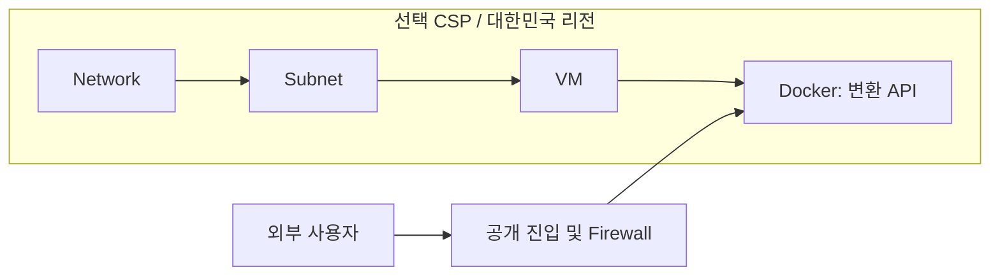
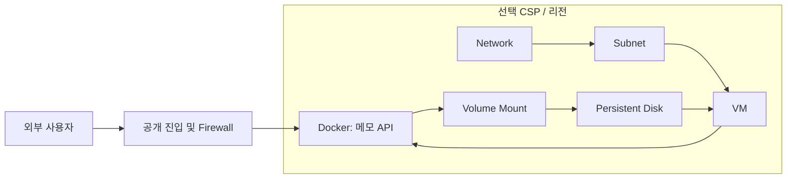
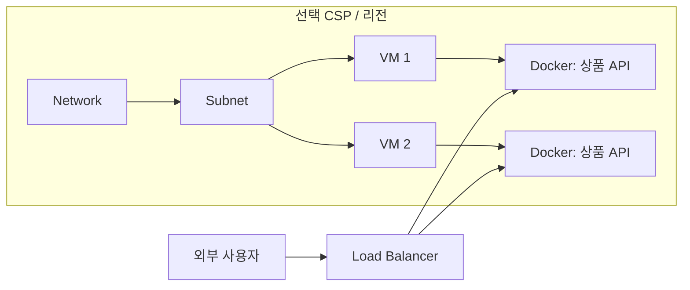

# 비교실험용 애플리케이션 프로필

> 갱신일: 2026-08-04
>
> 범위: AWS·Azure·GCP의 Docker-on-VM

## 1. 선정 원칙

테스트 앱은 기능 구현보다 클라우드 리소스 결정의 차이가 잘 드러나야 한다.

- 짧은 시간 안에 생성·실행·검증할 수 있을 것
- CSP 관리형 서비스 없이 VM과 Docker로 배포할 수 있을 것
- 필수 리소스와 의존관계의 기준 답안을 만들 수 있을 것
- 영속성·가용성·예산 조건을 하나씩 추가해 결과 차이를 설명할 수 있을 것
- LLM CoT, MetaGPT, EasyDep에 같은 요구사항을 제공할 수 있을 것

네 프로필은 서로 다른 대형 서비스를 뜻하지 않는다. 단순한 REST 애플리케이션을 바탕으로 클라우드 제약만 단계적으로 바꾼다.

## 2. 공통 구현 조건

- Java 21, Spring Boot, Gradle
- REST API와 `/health` 엔드포인트
- Docker 이미지 1개
- Linux VM에서 실행
- 애플리케이션 포트는 설계 결과에 기록
- 비밀값은 이미지와 IaC에 직접 저장하지 않음
- AWS·Azure·GCP에서 같은 기능과 테스트 사용

언어와 프레임워크를 고정해 처리군 사이의 코드 복잡도와 실행 결과를 비교한다.

## 3. P1 — Stateless 변환 API

### 선정 이유

가장 단순한 공개 서비스다. 필요한 기본 네트워크·VM 리소스를 누락하는지, 반대로 디스크나 Load Balancer를 불필요하게 추가하는지 측정한다.

### 기능 및 제약

- 길이·무게·온도 단위를 변환하는 REST API
- 외부 사용자가 HTTPS로 호출
- 서버 측 데이터 저장 없음
- 고가용성 요구 없음
- 대한민국 배포, 낮은 월 예산

### 예상 리소스

- 필수: Network, Subnet, Firewall, VM, Docker Container
- 조건부: NIC, Public IP, Internet Gateway
- 불필요: Load Balancer, 영속 Disk

### 예상 배포 구조

### 핵심 테스트

- 변환 API 정확성
- Docker 이미지 빌드와 실행
- 외부 접근 및 헬스 체크
- 포트와 방화벽 규칙 일치

## 4. P2 — 영속 메모 API

### 선정 이유

영속성 요구가 클라우드 디스크, Docker 볼륨과 재시작 테스트로 연결되는지 확인한다.

### 기능 및 제약

- 메모 생성·조회·수정·삭제
- SQLite 사용
- VM 또는 컨테이너 재시작 후 데이터 보존
- 외부 HTTPS 접근
- 고가용성 요구 없음

### 예상 리소스

- P1의 기본 리소스
- 필수: 영속 Disk와 VM 연결
- 불필요: Load Balancer

### 예상 배포 구조

### 핵심 테스트

- CRUD 기능
- Docker 볼륨 마운트 확인
- 컨테이너 재시작 후 데이터 보존
- 디스크·VM·볼륨 관계 일치

## 5. P3 — 고가용성 상품 조회 API

### 선정 이유

부하와 장애 허용 요구가 VM 후보 제한, 복수 VM, Load Balancer와 헬스 체크로 이어지는지 평가한다.

### 기능 및 제약

- 읽기 전용 상품 목록·상세 조회
- 상품 데이터는 Docker 이미지에 포함된 고정 데이터
- 사전에 정의한 동시 요청 수와 응답시간 목표
- 단일 VM 장애 시에도 조회 기능 유지
- 서버 측 영속 데이터 없음

### 예상 리소스

- Network, Subnet, Firewall
- 최소 2개 VM 후보와 각 Docker Container
- Load Balancer와 헬스 체크
- 부하 측정에 맞는 VM 사양
- 불필요: 영속 Disk

### 예상 배포 구조

### 핵심 테스트

- 상품 조회 기능
- 목표 부하와 응답시간
- Load Balancer 헬스 체크
- 한 VM 중단 후 서비스 지속
- 추천 VM의 용량·성능·비용 조건 충족

## 6. P4 — 예산 충돌 상품 조회 API

### 선정 이유

P3의 기능과 가용성은 유지하면서 예산만 낮춘다. 시스템이 불가능하거나 불확실한 조건을 숨기지 않고 탐지하는지 평가한다.

### 기능 및 제약

- P3과 동일
- 대한민국 리전 사용
- 복수 VM과 Load Balancer를 감당하기 어려운 월 예산 상한

### 기대 결과

이 프로필에는 하나의 확정 배포 다이어그램을 정답으로 두지 않는다. 시스템은 다음 중 하나를 제시해야 한다.

- 예산 초과를 명시하고 P3 구조 유지
- 가용성 목표 완화 대안
- 더 낮은 사양의 후보와 성능 검증 필요성
- 해결할 수 없는 조건을 `unresolved`로 기록하고 사용자에게 질문

가용성이나 예산을 말없이 무시한 배포 계획은 실패로 판정한다.

## 7. 프로필별 평가 초점

### P5 — Medium synthetic voucher service

P5는 소형 프로필의 천장 효과를 확인하기 위한 중형 입력이다. PURE의 `Software
Requirements Specification for Voucher Management System`에서 **도메인과 SRS 규모·문장
형식만** 참고하고, 요구사항 문장은 새로 작성했다. PURE 원문은 포함하지 않는다.

- 입력: `inputs/cloud_native_voucher_medium.json`
- 규모: FR 16개, NFR 12개
- 배포 범위: Docker 기반 Linux VM, Azure Korea Central
- 주요 축: 영속 상태, 동시 상환, 피크 부하, 비동기 webhook, 보고서 파일, 비밀정보,
  감사 및 관측성
- 목적: 요구사항 커버리지뿐 아니라 Deployment Need 누락·과잉 추론, NFR 추적성,
  호출 수·토큰·실행시간이 입력 규모에 따라 어떻게 변하는지 측정

첫 실행(2026-08-05, `openai/gpt-oss-120b`, temperature 0)은 다음과 같다. 한 번의
관측이므로 모델 간 우열의 근거로 사용하지 않고, 확장성 병목을 찾는 프로파일로만 쓴다.

| 입력 | 요구사항 | UC | LLM 호출 | 토큰(prompt+completion) | 벽시계 시간 |
|---|---:|---:|---:|---:|---:|
| P1 | 5 | 1 | 9 | 7,506 + 6,203 | 48초 |
| P5 | 28 | 12 | 56 | 88,150 + 103,562 | 186초 |

P5 호출 56회 중 48회는 12개 UC 명세의 생성·의미검증·수리였다. 따라서 다음 성능 개선
대상은 앞단 추출이 아니라 명세 반성 루프의 호출 예산과 부분 결과 체크포인트다. 첫 P5
시도는 전체 실행 제한 10분을 넘겼고 산출물을 남기지 못했으며, 재시도는 완료됐다.

| 프로필 | 추가되는 조건 | 핵심 정량 지표 |
|---|---|---|
| P1 | 기본 공개 서비스 | 리소스·의존관계 F1, 과잉 생성률 |
| P2 | 영속성 | Disk·Volume 누락률, 데이터 보존 성공률 |
| P3 | 부하·가용성 | 용량 충족률, LB 구성률, 장애 테스트 성공률 |
| P4 | 예산 충돌 | 예산 위반률, 충돌 탐지율, 허위 충족 수 |

코드 품질은 모든 프로필에서 테스트 통과 후 순환복잡도, Maintainability Index, 정적 분석 오류와 중복률로 비교한다.

## 8. 확정 전 필요한 값

- 공통 애플리케이션 포트 정책
- P1의 월 예산
- P3의 동시 요청 수·응답시간·테스트 시간
- P4의 월 예산과 가격 기준일
- CSP별 실제 배포 대상 조합
- 골드 리소스의 CSP별 동등 매핑

이 값은 파일럿 결과와 실제 CSP 가격을 확인한 뒤 고정한다.
